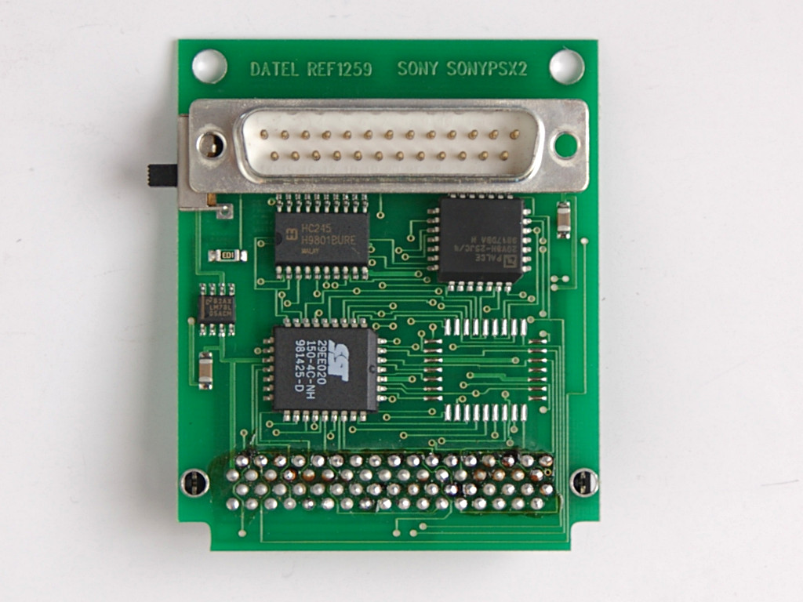

Python標準ライブラリloggingでのロギング
=================

## ロギングについて
プログラムの実行中の挙動を記録することを**ロギング(Logging)** といいます。
これに対してプログラムのデバッグの過程で、ある変数の値を出力させたり、どこまで動作しいるかをprint()などで表示させたりすることを**デバッグライト(Debug write)** といいます。

デバッグライトは開発やデバッグの作業中に、適宜パラメタや状況などを確認するためのもので、ロギングは設計段階から十分に考えられた記録と言えるでしょう。

ログには次の２つの目的があります。
- **診断(Diagnostic)**：プログラムの動作や状況を記録するためのログ
  - プログラムが設計どおりに動作しているかを検証するために利用される
- **監査(Audit)** ：ユーザの属性や行動パターンなどを記録するためのログ
  - 他のユーザとの比較などを検出するため利用される

一般的にロギングで必要になる機能には次のものがあります。

- 何が出力されるかを制御
- ログに含めたい情報の種類を定義
- ログが出力されたときにどのように見えるかの設定
- ログの出力先を設定(最も重量)

## ログレベル
ロギングにはどのレベルの情報を記録するのかを設定する **ログレベル(Log Level)** というものがあります。

 ロギングのレベル

| 名前 | 設定値 | 役割 |
|:--|:--|:--|
| NOTSET | 0 | 設定値などの記録（全ての記録） |
| DEBUG | 10 | 動作確認などデバッグ情報を記録 |
| INFO | 20 | 正常動作の記録 |
| WARNING | 30 | 異常とまでは言えない程度の問題 |
| ERROR | 40 | エラーなど重大な問題 |
| CRITICAL | 50 | 停止など致命的な問題 |

ログを記録する処理はコードに記述されていて、設定ファイルあるいはコマンド実行時にオプションとして与えたログレベルの情報だけがログファイルに記録される、といった目的で使用されます。

## logging モジュール
 `logging` モジュールは Python標準ライブラリです。この使用例を見てみましょう。


```
 In [2]: # %load 01_log_methods.py
    ...: import logging
    ...:
    ...: logging.log(20,'info message')
    ...: logging.log(30,'warning message')
    ...:
 WARNING:root:warning message

```

はじめに  `logging` をインポートして、 `log()` 関数でログ出力をしています。この関数は第１引数にログレベル、第２引数にログメッセージを与えます。
ここで、ログレベル20ではメッセージが出力されていないことがわかると思います。
この実行例は、IPython を使用していますが、デフォルトではINFOレベルのログは出力されないようになっているからです。
（後述の「**IPythonでのロギング**」 を参照）

次に  `info()` や  `warning()` といったログレベルに応じた出力を行う関数を使う場合は次のようになります。
 `log()` との違いは引数にログレベルを与える必要がないということです。


```
 In [2]: # %load 02_loglevel_methods.py
    ...: import logging
    ...:
    ...: logging.info('info message')
    ...: logging.warning('warningo message')
    ...:
 WARNING:root:warningo message

```

ここでも、先の例と同様にログレベルが INFO ではログ出力がないことがわかります。


## ログの出力先
ログの出力先はログハンドラーで設定します。
コンソール出力には  `StreamHandler()` を使用します。

 logging_streamhandler.py
```
 In [2]: # %load 03_streamhandler.py
    ...: import logging
    ...:
    ...: logger = logging.getLogger()
    ...: handler = logging.StreamHandler()
    ...: logger.addHandler(handler)
    ...: logger.setLevel(logging.DEBUG)
    ...: logger.debug('This is simple test')
    ...:
 This is simple test

```

デフォルトでは、標準エラー出力にログが送られます。

 bash
```
 % python 03_streamhandler.py
 This is simple test

 # 標準エラー出力を破棄すると何も出力されない
 % python 03_streamhandler.py 2>/dev/null

```


これまでは、コンソールが利用できる環境でアプリケーションを作ってきましたが、ネットワークアプリケーションやWebアプリケーションなどではコンソール出力が使えないことがあります。また、コンソールでの出力も直近２０行程度など過去に遡って情報を参照するようなことができないこともあります。
こうしたときには、 `logging.FileHandler()` を使ってファイルに記録するようにします。


```
 In [2]: # %load 04_filehandler.py
    ...: import logging
    ...:
    ...: logger = logging.getLogger()
    ...: handler = logging.FileHandler('sample.log')
    ...: logger.addHandler(handler)
    ...: logger.setLevel(logging.DEBUG)
    ...: logger.debug('This is simple test')
    ...:
    ...: # !cat sample.log
    ...:

 In [3]: !cat sample.log
 This is simple test

```

ロギングでは次のハンドラーを利用することができます。（一例です...)

-  `FileHandler` : ログをファイルに書き出す
-  `StreamHandler` ： ログをストリームのようなオブジェクト、例えばstdout経由でコンソールに送出
-  `SMTPHandler` ： e-mail を使って書き出す
-  `SocketHandler` ： ネットワークで接続したソケットに書き出す
-  `SyslogHandler` ,  `NTEventHandler` ：システムログとして書き出す
-  `HTTPHandlerは` ：HTTP経由でログを送信
-  `NullHandler` ：ログをどこにも送らない(一時的にログを停止するのに便利)


## ログ出力のテンプレート
また、 `logging.Formatter()` でログの出力書式のテンプレートも指定できます。

```
 In [2]: # %load 05_log_format.py
    ...: import logging
    ...:
    ...: formatter = logging.Formatter(
    ...:     '%(levelname)s:%(asctime)s:%(lineno)d:%(name)s:%(message)s')
    ...:
    ...: logger = logging.getLogger()
    ...: fh = logging.FileHandler('test.log')
    ...: fh.setFormatter(formatter)
    ...: logger.addHandler(fh)
    ...: logger.setLevel(logging.DEBUG)
    ...: logger.debug('This is sample.')
    ...:
    ...: # !cat test.log
    ...:

 In [3]: !cat test.log
 DEBUG:2021-09-27 18:51:58,077:12:root:This is sample.

```


 logging.Formatterで使用できる書式

| フォーマット　　　 | 役割　　　　　　　　 |
|:--|:--|
| %(asctime)s | 実行時刻 |
| %(filename)s | ファイル名 |
| %(funcName)s | 行番号 |
| %(levelname)s | ログの定義 |
| %(lineno)d | ログレベル名 |
| %(message)s | ログメッセージ |
| %(module)s | モジュール名 |
| %(name)s | 関数名 |
| %(process)d | プロセスID |
| %(thread)d | スレッドID |


- ログメッセージは、可能であれば別ファイルなどにまとめておきましょう。
  - ログはプログラムの本質とは関係ないことが理由のひとつ
  - メッセージを修正する過程で本体側のプログラムにバグを混入させないため
　日本語や機種依存文字などをログメッセージにしない’ようにしましょう。
　	そのログが読めないような環境もあるからです。
　コンソールから確認するようなことを意識して、１行８０文字以内の表示としましょう。
　	８０文字を超えた文字列が折り返されて表示されるとは限らないからです。
　	何より、ログを読むときに判読しずらくなります。


## ロギング設定ファイル
 `logging` のフォーマットやログレベルは設定ファイルから読むようにした方が、デバッグや不具合検証がしやすくなります。

次のコードは、プログラム中にロギング設定をハードコーディングした例です。

```
 In [2]: # %load 06_config_hardcoding.py
    ...: import logging
    ...:
    ...: formatter = logging.Formatter(
    ...:      '%(asctime)s %(name)-12s %(levelname)-8s %(message)s')
    ...:
    ...: logger = logging.getLogger()
    ...: handler = logging.StreamHandler()
    ...: handler.setFormatter(formatter)
    ...: logger.addHandler(handler)
    ...: logger.setLevel(logging.DEBUG)
    ...: logger.debug('This is simple test')
    ...:
 2021-09-27 18:54:20,054 root         DEBUG    This is simple test

```

logging で設定するものには、次のようなものがあります。

- **Formatter**：ログイベントを指定されたテキストフォーマットに変換する役割を担う。
- **Handler**：ストリームを受け取ってどこかに移動させる責任があります。
Pythonのロギングライブラリはいくつかのハンドラを含んでいます。SyslogHandlerとHTTPHandlerは、エージェントを使用せずにログを[Loggly ](https://github.com/mbabineau/loggly-python) に送信する方法を採用しています。
- **Filter**：フィルタでは、特定のメッセージを通過させないようにしたり、メッセージの情報を変更することができます。
例えば、情報レベル以上のメッセージのみをディスクに保存したり、ユーザーのIPアドレスがディスクに記録されないようにすることができます。
- **Logger**：すべてを結びつけるもの。ロガーは、ロギングフレームワークのメインAPIです。

これまでのサンプルのコードの中にも多くのことが設定されています。
設定を利用すると、異なるデプロイメント環境の間を移動するときに、ロギングの動作を簡単に変更することができます。例えば、開発環境ではDEBUGログをコンソールに出力し、本番環境ではINFOレベルからCRITICALレベルのログのみをファイルに保存したい場合などです。


プログラム中にハードコーディングしてしまうと、ログレベルやログフォーマットを変更するようなときに融通性がありません。logging は、特定のログのフォーマット、ハンドラー、および送信先を定義するPython辞書で受け取ることができます。
これを使って、モジュールに定義した辞書を読み込んでみましょう。

 logconf.py
```
 LOGGING_CONFIG = {
   'version': 1,   # 必須
   'disable_existing_loggers': False,
   'formatters': {
     'simple': {
       'format': '%(asctime)s %(name)-12s %(levelname)-8s %(message)s'
     }
   },
   'handlers': {
     'console': {
       'level': 'DEBUG',
       'class': 'logging.StreamHandler',
       'formatter': 'simple'
     }
   },
   'loggers': {
     'demo': {
       'level': 'DEBUG',
       'handlers': ['console']
     }
   }
 }
```


```
 In [2]: # %load 07_dictConfig.py
    ...: import logging
    ...: import logging.config
    ...: from logconf import LOGGING_CONFIG
    ...:
    ...: logging.config.dictConfig(LOGGING_CONFIG)
    ...: log = logging.getLogger('demo')
    ...: log.debug('This is simple test')
    ...:
 2021-09-27 19:57:40,543 demo         DEBUG    This is simple test

```

辞書で設定する場合、どうしてもタイプ数が増えるためコンソールアプリケーションなどでは利用しづらくなります。
 `'disable_existing_loggers': False` を与えていないと既存の設定を壊すことに注意してください。
これは、後述する  `fileConfig()` でも同様です。

そこで、次のような設定ファイルを作成してロギング設定を外部に書き出してみます。

 logconf.ini
```
 [loggers]
 keys=root

 [handlers]
 keys=stream_handler

 [formatters]
 keys=formatter

 [logger_root]
 level=DEBUG
 handlers=stream_handler

 [handler_stream_handler]
 class=StreamHandler
 level=DEBUG
 formatter=formatter
 args=(sys.stderr,)

 [formatter_formatter]
 format=%(asctime)s %(name)-12s %(levelname)-8s %(message)s
```

 `logging.config.fileConfig()` を使うと、この設定ファイルを読み込めます。


```
 In [2]: # %load 08_fileconfig.py
    ...: import logging
    ...: from logging.config import fileConfig
    ...:
    ...: fileConfig('logconf.ini')
    ...: logger = logging.getLogger()
    ...: logger.debug('This is simple test')
    ...:
 2021-09-27 18:56:11,102 root         DEBUG    This is simple test

```

 `fileConig()` に  `disable_existing_loggers=False` を与えないと、それまでの設定を破棄することになるので注意してください。

## 例外をトレースバックさせる
 `logging` の  `exception()` を使うと例外発生時のトレースバックをログすることができます。


```
 In [2]: # %load 09_traceback.py
    ...: import logging
    ...: from logging.config import fileConfig
    ...:
    ...: fileConfig('logconf.ini')
    ...: logger = logging.getLogger()
    ...: logger.debug('This is simple test')
    ...:
    ...: try:
    ...:     1 / 0
    ...: except ZeroDivisionError as msg:
    ...:     logger.exception(f'Raise Exception: {msg}')
    ...:
 2021-09-27 18:57:16,119 root         DEBUG    This is simple test
 2021-09-27 18:57:16,119 root         ERROR    Raise Exception: division by zero
 Traceback (most recent call last):
   File "<ipython-input-2-3a66a9366021>", line 10, in <module>
     1 / 0
 ZeroDivisionError: division by zero

```

## IPythonでのロギング
IPython にはlogging が組み込まれていて、起動時にオプション  `--log-level` でログレベルを変更することができます。
デフォルトは 30 (WARNING) です。

## モジュールからのロギング
Pythonアプリケーションは、おそらく多くのモジュールから構成されています。これらのモジュールは他のプログラムで使用されることを意図している場合もありますが、アプリケーション内で再利用可能なモジュールを意図的に開発していない限り、pypi から入手可能なモジュールや、アプリケーションに特化した独自のモジュールを使用していることも多いはずです。

通常は、モジュールではログ・メッセージを出すようにするべきですが、それらのメッセージがどのように処理されるかを設定すべきではありません。それは、アプリケーション側が担当するべきものです。

モジュール側でするべき重要なことは、アプリケーションがそのログメッセージを簡単にルーティングできるようにすることです。こうした理由から、モジュールは、そのモジュール自身と同じ名前のロガーを使用します。これにより、アプリケーションが異なるモジュールを簡単にルーティングすることができ、同時にモジュール内のログコードをシンプルに保つことができます。モジュールには、ロギングを設定するために次のように設定しておきます。

 pytohn
```
 import logging
 log = logging.getLogger(__name__)

```

 `__name__` は現在のモジュールのファイル名を含んでいるので、どのモジュールでもうまく動作します。

この後は、このロガー( `log` )を使用してログメッセージを出すようにしておきます。

 pytohn
```
 def do_something():
     log.debug("Doing something!")

```

## basicConfig()
logging では基本的な設定を行えるヘルパー関数  `basicConfig()` が提供されています。

簡単な使用例：

```
 import logging

 logging.basicConfig(filename = 'sample_a.log')
 log = logging.getLogger('sample')
 log.error('Some error')

```

フォーマットを指定した使用例：

```
 import logging
 # DEBUG, INFO, WARNING, ERROR, CRITICAL
 log_level = logging.INFO
 logging.basicConfig(filename = 'sample_b.log',
     level=log_level,
     filemode='w', # or 'a'
     format='%(asctime)s %(levelname)s: %(message)s',
     )
 log = logging.getLogger()
 log.info('Some info log')
 log.debug("Won't print at INFO level")

```

複数ファイルにログ出力する使用例：

```
 import logging

 log_level = logging.INFO
 def create_logger(filename, logname=''):
     handler = logging.FileHandler(filename)
     formatter = logging.Formatter(
         '%(asctime)s %(levelname)s: %(message)s'
         )
     handler.setFormatter(formatter)
     log = logging.getLogger(logname)
     log.setLevel(log_level)
     log.addHandler(handler)
     return log

 # 1st log file
 log1 = create_logger('sample_a.log', 'app1')
 log1.info('app1 info')
 # 2nd log file
 log2 = create_logger('sample_b.log', 'app2')
 log2.error('app2 error')
```


> 余談
> SONYのゲーム機 PlayStation1 に背面にあるコネクタに接続する Pro Action Replay
> これは動作中のPlayStation1 のメモリをダンプしたり、ダイナミックパッチを当てることができるというものでした。
>
> 
>
> この背面には RS-232C シリアルポート・コネクタが出ていて、
> これをコンピュータに接続することもできました。
> PlayStation1 には通常はOFFになっている標準出力（シリアルコンソール）が
> あるのですが、これをONにすると、ゲームの実行中にいろいろなログを見ることができました。
>
> 


参考:
- [Python公式ドキュメント loggingモジュール ](https://docs.python.org/3.6/library/logging.html#module-logging)


