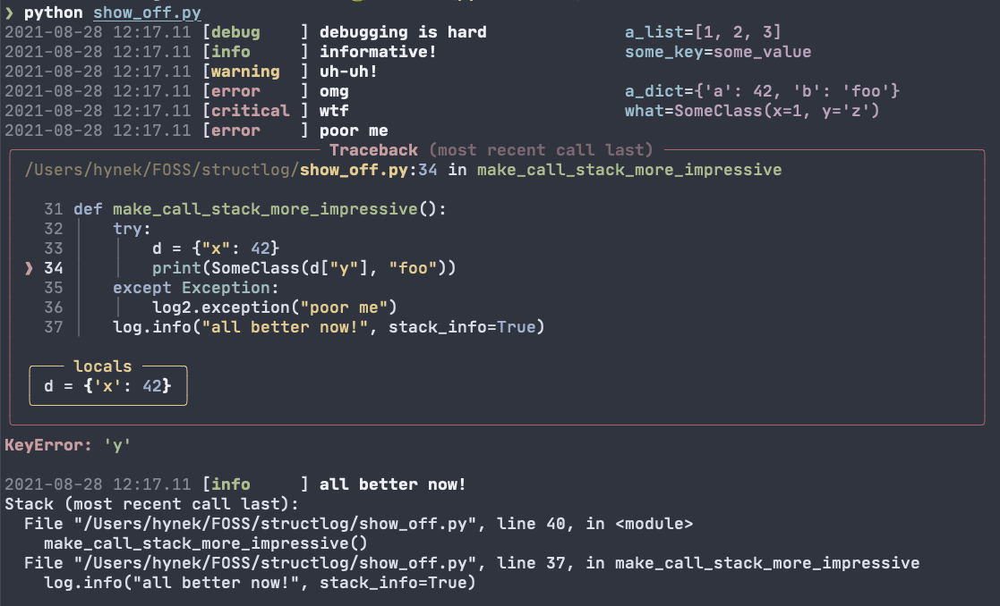
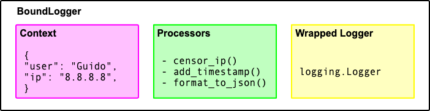

structlogを使ってロギングをしてみよう
=================


## structlog について

structlogは、ログエントリを構造化することで、Pythonでのログ取得をより速く、より簡単に、より強力にします。structlogは、asyncio やタイプヒントのような技術を取り入れながら、2013年以降、あらゆる規模のプロダクションで使用されてうまく機能しています。

structlog は非常に柔軟に設計されているため、ログエントリの出力をstructlogに任せるか、標準ライブラリのloggingモジュールのような既存のログシステムに転送するかということも自由になります。




## インストール
structlog は pip でインストールすることができます。

 bash
```
 $ pip install structlog

```

## structlog の使用方法
structlogは、できるだけドキュメントを読まなくても利用できるようにするために、多くの努力が払われています。実際、最もシンプルな使い方は次のようなものです。


```
 In [2]: # %load 01_intro.py
    ...: import structlog
    ...:
    ...: log = structlog.get_logger()
    ...: log.msg("greeted", whom="world", more_than_a_string=[1, 2, 3])
    ...:
 2021-09-23 20:25.11 [info     ] greeted                        more_than_a_string=[1, 2, 3] whom=world

```

この例では、structlogの便利なデフォルト設定を最大限に活用しています。

- 出力は、ユーザーに向かって情報を撒き散らしたり、あるいは何もしないのではなく、標準出力に送られます。
- すべてのキーワードは、structlog.dev.ConsoleRendererを使用してフォーマットされます。これは、すべての値を文字列にシリアライズするために `repr()` を使用しています。したがって、独自のオブジェクトのロギングのサポートを簡単に追加することができます。
- colorama がインストールされていれば、美しい色でレンダリングされます。

最も複雑なロギング設定でも、Configurationのおかげで、この例のように簡潔に記述できることに留意すべきです。上記の例を明示的に設定したものが、次のコードになります。


```
 In [2]: # %load 02_detailed.py
    ...: import logging
    ...: import structlog
    ...:
    ...: structlog.configure(
    ...:     processors=[
    ...:         structlog.processors.add_log_level,
    ...:         structlog.processors.StackInfoRenderer(),
    ...:         structlog.dev.set_exc_info,
    ...:         structlog.processors.format_exc_info,
    ...:         structlog.processors.TimeStamper(),
    ...:         structlog.dev.ConsoleRenderer()
    ...:     ],
    ...:     wrapper_class=structlog.make_filtering_bound_logger(logging.NOTSET),
    ...:
    ...:     context_class=dict,
    ...:     logger_factory=structlog.PrintLoggerFactory(),
    ...:     cache_logger_on_first_use=False
    ...: )
    ...:
    ...: log = structlog.get_logger()
    ...: log.msg("greeted", whom="world", more_than_a_string=[1, 2, 3])
    ...:
 1632396684.671951 [info     ] greeted                        more_than_a_string=[1, 2, 3] whom=world

```

そうです、これは構造化されたロギングです。しかし、これはstructlog だけの機能というわけではありません。なんといっても、標準ライブラリには構造化ロギングの[レシピ ](https://docs.python.org/ja/3/howto/logging-cookbook.html?highlight=logging%20cookbook) もあります。

## コンテキストの構築
上記のAPIだけですべての関連データをログアウトしたいと考えている仮想的なWebアプリケーションを想像してみてください。


```
 from structlog import get_logger

 log = get_logger()

 def view(request):
     user_agent = request.get("HTTP_USER_AGENT", "UNKNOWN")
     peer_ip = request.client_addr
     if something:
         log.msg("something", user_agent=user_agent, peer_ip=peer_ip)
         return "something"
     elif something_else:
         log.msg("something_else", user_agent=user_agent, peer_ip=peer_ip)
         return "something_else"
     else:
         log.msg("else", user_agent=user_agent, peer_ip=peer_ip)
         return "else"

```

呼び出し自体は要点を押さえていて良いのですが、あちこちで同じことを繰り返しコードしています。
この時点で、次のようなクロージャを書きたくなるでしょう。


```
 def log_closure(event):
    log.msg(event, user_agent=user_agent, peer_ip=peer_ip)
```

これで問題は解決するわけではありません。例えば、パラメーターが段階的に導入される場合はどうでしょう？ その場合は、それぞれのviewにロギング用のクロージャを定義する必要があるでしょうか？


> クロージャ(関数閉方)
> クロージャは、プログラミング言語の概念や機能の一つで、関数とそれを評価する環境を作ることです。
> わかりやすく言えば外側の変数を記憶した関数のことになります。


もっと良い方法を見てみましょう。


```
 from structlog import get_logger

 logger = get_logger()

 def view(request):
     log = logger.bind(
         user_agent=request.get("HTTP_USER_AGENT", "UNKNOWN"),
         peer_ip=request.client_addr,
     )
     foo = request.get("foo")
     if foo:
         log = log.bind(foo=foo)
     if something:
         log.msg("something")
         return "something"
     elif something_else:
         log.msg("something_else")
         return "something_else"
     else:
         log.msg("else")
         return "else"

```

この方法では、ロガーがクロージャーとして機能します。

structlogにとってログエントリは、 `event dict` と呼ばれる辞書に過ぎません。

辞書の一部を段階的に事前構築することができます。これらの事前に保存された値は、コンテキストと呼ばれます。

イベントが発生するとすぐに - これも辞書ですが - コンテキストと一緒にイベントディクショナリにマージされ、ログアウトされます。

コンテキストを事前に構築するというコンセプトが気に入らない場合は、やめておきましょう。便利なキーバリューベースのロギングは、それだけでも素晴らしいものです。

Python はデフォルトでは、辞書をキーで並べておきます。

値をバインドする推奨される方法は、これらの例にあるように、新しいコンテキストで新しいロガーを作成することです。利便性のために不変のローカル状態を諦めても構わないのであれば、スレッド/グリーンレットのローカルストレージやコンテキスト変数をコンテキストに使用することもできます。

## ログエントリを簡単に操作
ログイベントが辞書になったことで、単なる文字列の場合よりもはるかに簡単に操作できるようになりました。

これを容易にするために、structlogにはプロセッサチェーンという概念があります。プロセッサは、関数のような呼び出し可能なもので、イベント辞書と他の2つの引数を受け取り、渡されたものとは異なるかもしれない新しいイベント辞書を返します。チェーン内の次のプロセッサは、元の辞書の代わりに、返された辞書を受け取ります。

例えば、すべてのイベントディクショナリーにタイムスタンプを追加したいとしましょう。その場合のプロセッサは次のようになります。


```
 import datetime
 def timestamper(_, __, event_dict):
     event_dict["time"] = datetime.datetime.now().isoformat()
     return event_dict

```

素朴なPython、素朴な辞書。さて、あなたは structlog を設定することで、あなたのプロセッサについて教えなければなりません。

```
 structlog.configure(
     processors=[timestamper,
                 structlog.processors.KeyValueRenderer()])
 structlog.get_logger().msg("hi")
```

## レンダリング
最後に、ログエントリの実際のフォーマットをコントロールしたいと思います。

前のセクションで気づいたかもしれませんが、レンダラーは単なるプロセッサでもあります。また、レンダラは必ずしもイベント辞書を文字列にレンダリングする必要はないことにも注意してください。どのような入力を得るべきかは、structlogでラッピングされたロガーに依存します。

しかし、ほとんどの場合、それは文字列になるはずです。

ベストプラクティスに従い、イベント辞書をELKやGraylogのようなログアグリゲーションシステムに拾われるようなJSONにレンダリングしたい場合、structlogにはバッテリーが付属しており、JSONRendererを使用するように指示する必要があります。


```
 structlog.configure(processors=[structlog.processors.JSONRenderer()])
 structlog.get_logger().msg("hi")
```

## structlogと標準ライブラリのロギング
structlogの主な用途は印刷ではありません。代わりに、既存のロガーをラップして、構造と増分的なコンテキスト構築を追加することを目的としています。そのため、structlogは基礎となるロガーを完全に無視することができ、好きなロガーと一緒に使用することができます。

このような「既存のロガー」の最も顕著な例は、間違いなく標準ライブラリのロギングモジュールです。この一般的なケースをできるだけ簡単にするために、structlogにはいくつかのツールが付属しています。


```
 import logging
 logging.basicConfig()

 from structlog.stdlib import LoggerFactory
 structlog.configure(logger_factory=LoggerFactory())
 log = structlog.get_logger()
 log.warning("it works!", difficulty="easy")

```

つまり、標準ライブラリのロガー・ファクトリを使いたいことをstructlogに伝え、これまでのように  `get_logger()` を呼び出します。
structlogは主に標準ライブラリの logging と一緒に使われるため、できるだけ速く、便利にするための工夫がされています。


## BoundLogger
structlogの中心は、ログラッパーであるBoundLogger です。



BoundLogger が行っている処理を説明すると、次のようになります。

- すべてのログエントリの一部となるべきキーと値のペアを持つコンテキスト辞書を保存する。
- すべてのログエントリで呼び出されるプロセッサのリストを格納する。
- そして、それをラップしているロガーを保存します。

これは標準ライブラリの logging.Logger である可能性がありますが、絶対にそうする必要はありません。

コンテキスト辞書を操作するために、次のことを提供します。

- (オプションの)追加のコンテキストデータを用いて自分自身を再生成する:  `bind()` および  `new()` .
- 少ないコンテキストデータで再生成する:  `unbind().`

いずれにしても、元のバインドされたロガーやそのコンテキストが変更されることはありません。
次に、BoundLoggerで他のメソッドを呼び出すと、以下のようになります。

- コンテキストのコピーを作成します (これでイベント辞書になります)。
- メソッド呼び出しのキーワード引数をイベント ディクショナリーに追加します。
- メソッド呼び出しの最初の位置引数の値を持つ新しいキーイベントをイベントディクショナリに追加します。
- イベントディクショナリ上でプロセッサを実行します。各プロセッサは、前任者の結果を受け取ります。

最後に、最後のプロセッサーの結果を受け取り、バインドされたロガーで呼び出された同じ名前のメソッドを、ラップされた logger で呼び出します。柔軟性を持たせるために、最終プロセッサは、位置パラメータとして直接渡される文字列、または `wrapped_logger.log_method(*args, **kwargs)` として渡されるタプル `(args, kwargs)` のいずれかを返すことができます。

## BoundLogger の作成
ほとんどの場合、自分でインスタンスを作成することはありません。実際には、structlogを設定して、structlog.get_loggerを呼び出すだけです。

しかし、まれに自分でインスタンスを作成したい場合があります。そのような場合には、 structlog.wrap_logger関数を使用して、グローバルな状態（つまり設定）なしでロガーをラップすることができます。


```
 In [2]: # %load 20_boundlogger.py
    ...: import structlog
    ...:
    ...: class CustomPrintLogger:
    ...:     def msg(self, message):
    ...:         print(message)
    ...:
    ...: def proc(logger, method_name, event_dict):
    ...:     print("I got called with", event_dict)
    ...:     return repr(event_dict)
    ...:
    ...: log = structlog.wrap_logger(
    ...:     CustomPrintLogger(),
    ...:     wrapper_class=structlog.BoundLogger,
    ...:     processors=[proc],
    ...: )
    ...:
    ...: # log2 = log.bind(x=42)
    ...: # log == log2
    ...: # log.msg("hello world")
    ...: # log2.msg("hello world")
    ...:
    ...: # log3 = log2.unbind("x")
    ...: # log == log3
    ...: # log3.msg("nothing bound anymore", foo="Python")
    ...:

 In [3]: log2 = log.bind(x=42)

 In [4]: log == log2
 Out[4]: False

 In [5]: log.msg("hello world")
 I got called with {'event': 'hello world'}
 {'event': 'hello world'}

 In [6]: log2.msg("hello world")
 I got called with {'x': 42, 'event': 'hello world'}
 {'x': 42, 'event': 'hello world'}

 In [7]: log3 = log2.unbind("x")

 In [8]: log == log3
 Out[8]: True

 In [9]: log3.msg("nothing bound anymore", foo="Python")
 I got called with {'foo': 'Python', 'event': 'nothing bound anymore'}
 {'foo': 'Python', 'event': 'nothing bound anymore'}

```


ご覧の通り、1つの必須引数といくつかのオプション引数を受け付けます。

- **logger**
1つだけの位置引数は、ラップしたいロガーで、ログエントリがプロキシされる先です。設定された logger ファクトリを使用したい場合は、None に設定してください。
- ** processors**
ラップされたロガーに渡される前に、ログ エントリをフィルタリング、ミューテーション、およびフォーマットすることができるコール可能なリストです。
デフォルトは  `[StackInfoRenderer, format_exc_info(), TimeStamper, ConsoleRenderer]` です。
- **context_class**
コンテキストを保存するクラスです。特にスレッドローカルのコンテキスト保存に便利です。
Python 3.6以降とPyPyは順序付きの辞書を持っているので、デフォルトはプレーンなdictです。

さらに、以下のような引数も許されています。

- **wrapper_class**
BoundLoggerの代わりにラッピングに使うクラスです。これは、BoundLoggerのサブクラスにして、カスタムのロギングメソッドを追加したい場合に便利です。BoundLoggerのbind/newメソッドは、サブクラス化に対応しているので、それらを再実装する必要はありません。これがどのように見えるかについては、関連する例を参照してください。

- **initial_values**
新しくラップされたロガーが自動的に構築される値です。たとえば、モジュール名をコンテキストの一部として使用したい場合などに便利です。


## structlog の設定方法

### グローバルなデフォルト設定
ロギングをできるだけ邪魔にならず、簡単に使えるようにするために、structlogにはたくさんの設定オプションと便利な関数が用意されています。ここでは、  `structlog.get_logger() ` という、設定にのみ依存する究極の便利な関数を紹介します。

これらを使用することで、ファイルごとのロギングの定型文を次のように減らすことができます。


```
 from structlog import get_logger
 logger = get_logger()
```


そのため、アプリの初期化時に `structlog.configure()` を呼び出す必要があります。

そのためには、アプリの初期化時に `structlog.configure()` を呼び出す必要があります。
前出のサンプルコード  `20_boundlogger.py` は次のように書くことができます。


```
 In [2]: # %load 21_boundlogger_configure.py
    ...: import structlog
    ...:
    ...: def proc(logger, method_name, event_dict):
    ...:     print("I got called with", event_dict)
    ...:     return repr(event_dict)
    ...:
    ...: structlog.configure(processors=[proc], context_class=dict)
    ...: log = structlog.get_logger()
    ...: log.msg("hello world")
    ...:
 I got called with {'event': 'hello world'}
 {'event': 'hello world'}

```

変更箇所に注目すると次のとおりです。


```
 class CustomPrintLogger:
     def msg(self, message):
         print(message)
 # ...
 log = structlog.wrap_logger(
     CustomPrintLogger(),
     wrapper_class=structlog.BoundLogger,
     processors=[proc],
 )

```


```
 structlog.configure(processors=[proc], context_class=dict)
 log = structlog.get_logger()

```

これは、PrintLoggerがデフォルトのLoggerFactoryであることを利用しています。
 `configure()` での設定内容は  `wrap_logger()` にも適用されます。これは内部で使用されているためです。


```
 In [2]: # %load 22_boundlogger_wrap_logger.py
    ...: import structlog
    ...:
    ...: def proc(logger, method_name, event_dict):
    ...:     print("I got called with", event_dict)
    ...:     return repr(event_dict)
    ...:
    ...: structlog.configure(processors=[proc], context_class=dict)
    ...: log = structlog.wrap_logger(structlog.PrintLogger())
    ...: log.msg("hello world")
    ...:
 I got called with {'event': 'hello world'}
 {'event': 'hello world'}
```


 `structlog.configure()` を繰り返し呼び出しても、1つまたは複数の設定を行うだけで、残りの設定は影響を受けません。
structlogは、デフォルトと設定の処理に関して、最も影響が少ない方法で処理しようとします。

 `structlog.wrap_logger()` に渡される引数は、常に  `structlog.configure()` より優先されます。つまり、各ロガーに対してそれぞれ設定したものを上書きすることができます。

 `structlog.wrap_logger()` に `None` を渡すか、引数を省略すると、structlogは、 `structlog.configure()` を使用してデフォルト値を設定したかどうかをチェックし、設定されていればそれを使用します。

必要であれば、 `structlog.reset_defaults()` を使用して、グローバル構成をいつでもデフォルト値に戻すことができます。これはテストでは便利になります。

structlogがどのように構成されているかは、いつでも確認することができます。


```
 In [2]: # %load 23_check_configure.py
    ...: import structlog
    ...: from pprint import pprint
    ...:
    ...: class MyDict(dict):
    ...:     pass
    ...:
    ...: v1 = structlog.is_configured()
    ...: v2 = structlog.configure(context_class=MyDict)
    ...: v3 = structlog.is_configured()
    ...:
    ...: cfg = structlog.get_config()
    ...: v4 = cfg["context_class"]
    ...:
    ...: # print(v1)
    ...: # print(v2)
    ...: # print(v3)
    ...: # pprint(cfg)
    ...: # print(v4)
    ...:

 In [3]: print(v1)
 False

 In [4]: print(v2)
 None

 In [5]: print(v3)
 True

 In [6]: pprint(cfg)
 {'cache_logger_on_first_use': False,
  'context_class': <class '__main__.MyDict'>,
  'logger_factory': <structlog._loggers.PrintLoggerFactory object at 0x7fac37d467f0>,
  'processors': [<function add_log_level at 0x7fac37cac5e0>,
                 <structlog.processors.StackInfoRenderer object at 0x7fac3918a190>,
                 <function set_exc_info at 0x7fac39197940>,
                 <function format_exc_info at 0x7fac391d1ca0>,
                 <structlog.processors.TimeStamper object at 0x7fac391c3f80>,
                 <structlog.dev.ConsoleRenderer object at 0x7fac3918a400>],
  'wrapper_class': <class 'structlog._log_levels.BoundLoggerFilteringAtNotset'>}

 In [7]: print(v4)
 <class '__main__.MyDict'>

```

### LoggerFactory
 `structlog.get_logger()` を動作させるためには、まだ説明されていないオプションが必要です。

これは、ラッピングされて返されるロガーを返す呼び出し可能なものです。最も単純なケースでは、それはロガーを返す関数、または単なるクラスです。しかし、より複雑な設定のために、 `__call__()` メソッドでクラスのインスタンスを渡すこともできます。

> バージョン0.4.0の新機能： structlog.get_loggerは、オプションで位置パラメーターを取ることができます。

これらはLoggerFactoryに渡されます。たとえば、 `structlog.get_logger("a name")` を使用し、位置パラメーターをサポートする標準ライブラリーのLoggerFactoryを使用するようにstructlogを設定した場合、返されるロガーの名前は "a name "になります。

カスタムロガーファクトリを書くときは、位置パラメーターを使用しない場合でも、常に位置パラメーターを受け入れるべきです。これにより、ロガーの互換性が確保されます。

標準ライブラリの logging とTwistedのロギングという一般的なケースのために、structlogには2つのファクトリーが組み込まれています。

-  `structlog.stdlib.LoggerFactory`
-  `structlog.twisted.LoggerFactory`

> twisted ライブラリ
> 標準ライブラリのsocketモジュールの代わりに使用できるネットワーククライアントを作成するためのライブラリ。
> Twistedを使うと簡潔に書けてリトライも簡単になります。

したがって、標準ライブラリのロギングでstructlogを使用するために必要なことは、次のとおりです。


```
 In [2]: # %load 24_logger_factory.py
    ...: from structlog import get_logger, configure
    ...: from structlog.stdlib import LoggerFactory
    ...:
    ...: configure(logger_factory=LoggerFactory())
    ...: log = get_logger()
    ...:
    ...: log.critical("this is too easy!")
    ...:
 2021-09-24 12:22.55 [critical ] this is too easy!

```

 `structlogのstructlog.stdlib.LoggerFactory` を使用することで、関数名や行番号などの変数がログ形式で正しく展開されることも保証されています。

設定なしで  `structlog.get_logger()` を呼び出すと、完全に有用な  `structlog.PrintLogger` が得られます。structlog ではサイレント ロガーが賢明なデフォルトであるとは考えていません。

### 設定を行う場所
設定を行うのに最適な場所は、アプリケーションやフレームワークによって異なります。理想的なのは、できるだけ遅く、フレームワーク以外の（つまりあなたの）コードが実行される前に行うことです。標準ライブラリのロギングを使用している場合は、それらを隣り合わせで設定するのが理にかなっています。

## スレッド ローカルコンテクスト
### 不変性(Immutability)
自分自身をコピーし、新しい値を追加し、結果を返すという動作は、クラスやクロージャを使って自分のコンテキストをなんとなく維持しているアプリケーションにとって便利です。Twistedはそのための良い例です。もう一つの可能なアプローチは、ラッピングされたロガーを渡すか、ビューの中だけでログを取り、リターンコードや例外を使ってエラーやイベントを収集することです。structlog においては何んの制約もないので、もしそうしたいのであれば、それにこだわることもできます。ただし、遅かれ早かれ、グローバルな状態や変更可能なデータは不愉快な結果をもたらすことになります。

しかし、従来のWebアプリケーション開発の場合、ロガーを渡すことはむしろ面倒で邪魔なものであり、一般的には主流の方法ではないと認識されています。structlogは、純粋で上品であることよりも、人々が実際にstructlogを使用することの方が重要であるため、structlog.threadlocalモジュールと、それを助けるいくつかの仕組みを提供しています。

### merge_threadlocalプロセッサ
structlogは、特定のフィールドをグローバル(スレッドローカル)コンテキストに明示的にバインドし、後でプロセッサを使用してそれらをイベントディクトにマージすることを可能にする単純な関数のセットを提供します。

これらの関数を使用する一般的な流れは次のとおりです。

- 最初のプロセッサとして  `structlog.threadlocal.merge_threadlocal()` を含む  `structlog.configure()` を使用します。
-  `structlog.threadlocal.clear_threadlocal()` をリクエスト ハンドラの最初 (またはスレッドローカル コンテキストをリセットしたいとき) に呼び出します。
- 特定の変数をスレッド・ローカル・コンテキストにバインドしたい場合、バインドされたロガーの  `bind()` の代わりに  `structlog.threadlocal.bind_threadlocal()` を呼び出します。

structlogは通常どおり使用します。ロガーはいつものように動作しますが、 `structlog.threadlocal.merge_threadlocal` プロセッサにより、スレッドローカルのバインドがすべてのログメッセージに含まれるようになります。


```
 In [2]: # %load 25_thread_local_processor.py
    ...: import structlog
    ...: from structlog.threadlocal import (
    ...:     bind_threadlocal,
    ...:     clear_threadlocal,
    ...:     merge_threadlocal,
    ...: )
    ...:
    ...: from structlog import configure
    ...:
    ...: configure(
    ...:     processors=[
    ...:         merge_threadlocal,
    ...:         structlog.processors.KeyValueRenderer(),
    ...:     ]
    ...: )
    ...:
    ...: log = structlog.get_logger()
    ...:
    ...: clear_threadlocal()
    ...: bind_threadlocal(a=1)
    ...:
    ...: # log.msg("hi")
    ...:
    ...: # clear_threadlocal()
    ...: # log.msg("hi there")
    ...:

 In [3]: log.msg("hi")
 a=1 event='hi'

 In [4]: log.msg("Python Osaka")
 a=1 event='Python Osaka'

 In [5]: clear_threadlocal()

 In [6]: log.msg("hi there")
 event='hi there'

```

### スレッドローカルなコンテキスト
structlogはまた、スレッドローカルなコンテキストをFlaskのような形で保存することができます。

これにより、構造体の動作を理解することが難しくなるため、一般的には merge_threadlocal を経由して使用することが推奨されます。

### ラップされた辞書
コンテキストをスレッドローカルにするために、structlogにはdict型をラップしてスレッドローカルなストレージとして使用できるようにする関数が用意されています。

1つのスレッド内では、返されたクラスのすべてのインスタンスは、ラップされたdict型の共通のインスタンスを持ちます。


```
 In [2]: # %load 26_thread_local_context.py
    ...: from structlog.threadlocal import wrap_dict
    ...:
    ...: WrappedDictClass = wrap_dict(dict)
    ...:
    ...: d1 = WrappedDictClass({"a": 1})
    ...: d2 = WrappedDictClass({"b": 2})
    ...: d3 = WrappedDictClass()
    ...:
    ...: v1 = d3["c"] = 3
    ...: v2 = d1 is d3
    ...: v3 = d1 == d2 == d3 == WrappedDictClass()
    ...:
    ...: # print(v1)
    ...: # print(v2)
    ...: # print(v3)
    ...: # print(d3)
    ...:

 In [3]: print(v1)
 3

 In [4]: print(v2)
 False

 In [5]: print(v3)
 True

 In [6]: print(d3)
 <WrappedDict-87379c9f-1a74-495c-99d3-1d51762172e6({'a': 1, 'b': 2, 'c': 3})>

```

 `structlog.threadlocal.wrap_dict()` は、常に完全に新しいラップされたクラスを返します。


```
 In [2]: # %load 27_wrap_dict.py
    ...: from structlog.threadlocal import wrap_dict
    ...:
    ...: WrappedDictClass = wrap_dict(dict)
    ...: AnotherWrappedDictClass = wrap_dict(dict)
    ...:
    ...: v1 = WrappedDictClass() != AnotherWrappedDictClass()
    ...: v2 = WrappedDictClass.__name__
    ...: v3 = AnotherWrappedDictClass.__name__
    ...:
    ...: # print(v1)
    ...: # print(v2)
    ...: # print(v3)
    ...:

 In [3]: print(v1)
 True

 In [4]: print(v2)
 WrappedDict-82c157fc-5ec4-4583-8cc8-8c711c7beda4

 In [5]: print(v3)
 WrappedDict-f8de11ae-bf44-4db4-ab94-391eef822732

```

ロガーに値を一時的にバインドするために、 structlog.threadlocal には  `structlog.threadlocal.tmp_bind()` というコンテキストマネージャーがあります。


```
 In [2]: # %load 28_threadlocal_tmp_bind.py
    ...: import structlog
    ...: from structlog.threadlocal import tmp_bind
    ...:
    ...: log = structlog.get_logger()
    ...:
    ...: log.bind(x=42)
    ...: log.msg("event!")
    ...:
    ...: with tmp_bind(log, x=23, y="foo") as tmp_log:
    ...:     tmp_log.msg("another event!")
    ...:
    ...: log.msg("one last event!")
    ...:
 Out[2]: <BoundLoggerFilteringAtNotset(context={'x': 42}, processors=[<function add_log_level at 0x7fccb31925e0>, <structlog.processors.StackInfoRenderer object at 0x7fccb31cb880>, <function set_exc_info at 0x7fccb3192af0>, <function format_exc_info at 0x7fccb3177d30>, <structlog.processors.TimeStamper object at 0x7fccb31c8c40>, <structlog.dev.ConsoleRenderer object at 0x7fccb31cb910>])>
 2021-09-24 13:13.48 [info     ] event!
 2021-09-24 13:13.48 [info     ] another event!                 x=23 y=foo
 2021-09-24 13:13.48 [info     ] one last event!

```

アプリケーションがスレッドを再利用していないと断定できない場合は、 各リクエストの開始時にスレッドのローカルコンテキストを ( `bind()` の代わりに)  `new()` で初期化することを忘れてはいけません。そうしないと、前のリクエストのデータが入ったままの状態で新しいリクエストを開始してしまう可能性があります。

状態はグローバルなデータ構造に保存されますが、グローバルなラップドロガーが実際のバウンドロガーを生成する必要があります。そうしないと、ログを呼び出すたびに、一時的なBoundLoggerのインスタンスが生成されてしまいます。
そのため、 `bind()` と  `new()` の結果を使用するようにしてください。

- **OK**

```
 log = log.new(y=23)
 log = log.bind(x=42)
```

- **NG**

```
 log.new(y=23)
 log.bind(x=42)
```

スレッドロケールに対する一般的な意見は、テストが難しいというものです。今回のケースでは、これは許容できるトレードオフだと考えています。APIを適切に使用すれば、キャプチャーしたプロセッサを使用して簡単に決定論的なテストを書くことができます。

この大きな赤い箱は、不変のローカルデータと可変のグローバルデータを分けるということです。

## コンテキスト変数
これまで structlog はスレッドローカルなコンテキストバインディングしかサポートしていませんでした。Python 3.7 で contextvars が導入されたことにより、現在のコンテキストにローカルなグローバルコンテキストを持つことができるようになり、 asyncio を使用したコードなどの同時実行コードでも動作するようになりました。

structlogは、変数をコンテキストローカルなコンテキストにバインドするための関数群を備えたstructlog.contextvarsモジュールを提供しています。このコンテキストは、非同期コードで使用しても安全です。

一般的な流れは以下の通りです。

-  `structlog.contextvars.merge_contextvars()` を含む `structlog.configure()` を最初のプロセッサとして使用します。
-  `structlog.contextvars.clear_contextvars()` をリクエストハンドラの最初に呼び出します (または、コンテキストローカルコンテキストをリセットしたいときはいつでも)。
- キーと値のペアをコンテキストローカルのコンテキストにバインドしたりアンバインドしたりする場合は、バインドされたロガーの  `bind()` と  `unbind()` の代わりに  `structlog.contextvars.bind_contextvars()` と  `structlog.contextvars.unbind_contextvars()` を呼び出します。
- structlogを通常通り使用します。ロガーは通常どおりに動作しますが、`structlog.contextvars.merge_contextvars() プロセッサにより、すべてのログ メッセージにコンテキスト ローカル バインドが含まれるようになります。


```
 In [2]: # %load 29_context_manager_contex.py
    ...: import structlog
    ...: from structlog.contextvars import (
    ...:     bind_contextvars,
    ...:     clear_contextvars,
    ...:     merge_contextvars,
    ...:     unbind_contextvars,
    ...: )
    ...:
    ...: structlog.configure(
    ...:     processors=[
    ...:         merge_contextvars,
    ...:         structlog.processors.KeyValueRenderer(key_order=["event", "a"]
    ...: ),
    ...:     ]
    ...: )
    ...:
    ...: log = structlog.get_logger()
    ...:
    ...: clear_contextvars()
    ...: bind_contextvars(a=1, b=2)
    ...:
    ...: # log.msg("hello")
    ...: # log.msg("world")
    ...:
    ...: # clear_contextvars()
    ...: # log.msg("hi there")
    ...:

 In [3]: log.msg("hello")
 event='hello' a=1 b=2

 In [4]: log.msg("world")
 event='world' a=1 b=2

 In [5]: clear_contextvars()

 In [6]: log.msg("hi there")
 event='hi there' a=None

```

## テスト
structlogには、アプリケーションのログ動作をテストするためのツールが付属しています。

unittest.TestCase.assertLogsのような機能が必要な場合や、その他の理由ですべてのログをキャプチャしたい場合は、structlog.testing.capture_logsコンテキストマネージャを使用できます。


```
 In [2]: # %load 30_test.py
    ...: from structlog import get_logger
    ...: from structlog.testing import capture_logs
    ...:
    ...: with capture_logs() as cap_logs:
    ...:    get_logger().bind(x="y").info("hello")
    ...:
    ...: # cap_logs
    ...:

 In [3]: cap_logs
 Out[3]: [{'x': 'y', 'event': 'hello', 'log_level': 'info'}]

```

コンテキストマネージャー内では、設定されたすべてのプロセッサが無効になっていることに注意してください。

 `structlog.testing.LogCapture()` を使って独自のヘルパーを構築することができます。たとえば、ログ出力をキャプチャするpytestのフィクスチャは次のようになります。

> このサンプルを実行するためには、pytest をインストールする必要があります。
> $ pip install pytest

 some_module2.py
```
 from structlog import get_logger

 logger = get_logger()
 def some_function(data: str = 'python') -> str:
     logger.error("previous data", name=data)
     return data.upper()

```

 31_pytest_fixture.py
```
 import pytest
 import structlog
 from structlog.testing import LogCapture
 from some_module2 import some_function
 from pprint import pprint

 @pytest.fixture(name="log_output")
 def fixture_log_output():
     return LogCapture()

 @pytest.fixture(autouse=True)
 def fixture_configure_structlog(log_output):
     structlog.configure(
         processors=[log_output]
     )

 def test_my_stuff(log_output):
     some_function()
     pprint(log_output.entries)
     expect_entry = {'event': 'previous data',
                     'log_level': 'error',
                     'name': 'python'}
     assert log_output.entries == []

```


 bash
```
 % pytest 31_pytest_fixture.py
 ============================ test session starts =============================
 platform darwin -- Python 3.9.0, pytest-6.2.5, py-1.10.0, pluggy-1.0.0
 rootdir: /Users/goichiiisaka/Projects/Python.Osaka/Tutorial.Logging/structlog
 collected 1 item

 31_pytest_fixture.py .                                                 [100%]

 ============================= 1 passed in 0.13s ==============================

```


 `structlog.testing.CapturingLogger()` （直接、または常に同じロガーを返すCapturingLoggerFactoryを介して）を使用することもできますが、これはより低レベルでユニットテストに最適です。


```
 In [2]: # %load 32_unittest.py
    ...: import structlog
    ...:
    ...: cf = structlog.testing.CapturingLoggerFactory()
    ...: structlog.configure(logger_factory=cf,
    ...:                     processors=[structlog.processors.JSONRenderer()])
    ...: log = structlog.get_logger()
    ...:
    ...: # log.info("test!")
    ...: # cf.logger.calls
    ...:

 In [3]: log.info("test!")

 In [4]: cf.logger.calls
 Out[4]: [CapturedCall(method_name='info', args=('{"event": "test!"}',), kwargs={})]

```


## プロセッサー(Processor)のサンプル
プロセッサ(Processor)はstructlogのシンプルかつパワフルな機能です。

タイムスタンプをログエントリの構造の一部としたり、パスワードを検閲したり、ログレベル以下のログエントリをレンダリングする前にフィルタリングしたり、出力をJSONにして解析しやすくしたりすることができます。


```
 In [2]: # %load 50_example_processor.py
    ...: import datetime, logging, sys
    ...: from structlog import wrap_logger
    ...: from structlog.processors import JSONRenderer
    ...: from structlog.stdlib import filter_by_level
    ...:
    ...: logging.basicConfig(stream=sys.stdout, format="%(message)s")
    ...:
    ...: def add_timestamp(_, __, event_dict):
    ...:     event_dict["timestamp"] = datetime.datetime.utcnow()
    ...:     return event_dict
    ...:
    ...: def censor_password(_, __, event_dict):
    ...:     pw = event_dict.get("password")
    ...:     if pw:
    ...:         event_dict["password"] = "*CENSORED*"
    ...:     return event_dict
    ...:
    ...: log = wrap_logger(
    ...:     logging.getLogger(__name__),
    ...:     processors=[
    ...:         filter_by_level,
    ...:         add_timestamp,
    ...:         censor_password,
    ...:         JSONRenderer(indent=1, sort_keys=True)
    ...:     ]
    ...: )
    ...:
    ...: # log.info("something.filtered")
    ...: # log.warning("something.not_filtered", password="secret")
    ...:

 In [3]: log.info("something.filtered")

 In [4]: log.warning("something.not_filtered", password="secret")
 {
  "event": "something.not_filtered",
  "password": "*CENSORED*",
  "timestamp": "datetime.datetime(2021, 9, 23, 23, 24, 41, 873524)"
 }

```

## Flaskとスレッドのローカルデータのサンプル
最も単純なケースでは、どのログエントリがどのリクエストに属しているかを簡単に確認できるように、すべての受信リクエストに一意のリクエストIDをバインドします。

> このサンプルを実行するためには、Flask がインストールされている必要があります。
> $ pip install flask

まず、次のようなシンプルな Flask の Webアプリケーションで説明します。

 templates/index.html
```
 <html>
   <body>
     <H1>Hello {{ name }}</H1>
   </body>
 </html>
```

 some_module.py
```
 def some_function(data: str) -> str:
     return data.upper()

```

 51_example_flask.py
```
 from flask import Flask, render_template
  from some_module import some_function

  app = Flask(__name__, template_folder='templates')
  @app.route('/greeting/<name>')
  def index(name):
      name = some_function(name)
      return render_template('index.html', name=name)

  if __name__ == '__main__':
      app.run(debug=True)

```

これは、URL ` http://localhost:5000/greeting/` に続けた文字列が表示されるだけのものです。
これを実行すると次のようなログが出力されます。Flask側のログに注目しています。

 bash
```
 $ python 51_example_flask.py
  * Serving Flask app '31_example_flask' (lazy loading)
  * Environment: production
    WARNING: This is a development server. Do not use it in a production deployment.
    Use a production WSGI server instead.
  * Debug mode: on
  * Running on http://127.0.0.1:5000/ (Press CTRL+C to quit)
  * Restarting with stat
  * Debugger is active!
  * Debugger PIN: 126-741-830
 127.0.0.1 - - [24/Sep/2021 09:35:25] "GET /greeting/Python HTTP/1.1" 200 -
 127.0.0.1 - - [24/Sep/2021 09:35:25] "GET /favicon.ico HTTP/1.1" 404 -
```

この Webアプリケーションを structlog を使ってログ情報を追加してみましょう。

 some_module2.py
```
 from structlog import get_logger

 logger = get_logger()
 def some_function(data: str) -> str:
     logger.error("previous data", name=data)
     return data.upper()

```

 52_example_flask_with_structlogpy
```
 from flask import Flask, render_template, request
 from some_module2 import some_function
 import sys
 import uuid
 import logging
 import structlog

 logger = structlog.get_logger()
 app = Flask(__name__, template_folder='templates')
 @app.route('/greeting/<name>')
 def index(name):
     structlog.threadlocal.clear_threadlocal()
     structlog.threadlocal.bind_threadlocal(
         view=request.path,
         request_id=str(uuid.uuid4()),
         peer=request.access_route[0],
     )
     log = logger.bind()
     name = some_function(name)
     log.info('name: ', name=name)

     return render_template('index.html', name=name)

 if __name__ == '__main__':
     logging.basicConfig(
         format="%(message)s", stream=sys.stdout, level=logging.INFO
     )
     structlog.configure(
         processors=[
             structlog.threadlocal.merge_threadlocal,
             structlog.processors.KeyValueRenderer(
                 key_order=["event", "view", "peer"]
             ),
         ],
         logger_factory=structlog.stdlib.LoggerFactory(),
     )

     app.run(debug=True)

```


もとのコードが単純過ぎているので、とてもコード量が’増えたように見えますが、ポイントは２つです。

  - app.run() を呼び出す前に  `structlog.configure()` でログ設定を行う。
  - 各ビューでプロセッサを定義する

これだけで、後はここに  `log.info()` や `log.debug()` を呼び出すだけです。

 bash
```
 % python 52_example_flask_with_structlog.py
  * Serving Flask app '32_example_flask_with_structlog' (lazy loading)
  * Environment: production
    WARNING: This is a development server. Do not use it in a production deployment.
    Use a production WSGI server instead.
  * Debug mode: on
  * Running on http://127.0.0.1:5000/ (Press CTRL+C to quit)
  * Restarting with stat
  * Debugger is active!
  * Debugger PIN: 126-741-830
 event='previous data' view='/greeting/Python' peer='127.0.0.1' request_id='06e21fcd-ac47-4f4d-82b7-e211cf844fe0' name='Python'
 event='name: ' view='/greeting/Python' peer='127.0.0.1' request_id='06e21fcd-ac47-4f4d-82b7-e211cf844fe0' name='PYTHON'
 127.0.0.1 - - [24/Sep/2021 10:44:54] "GET /greeting/Python HTTP/1.1" 200 -

```

 `event-=` で始まっているログが structlog で書き込まれたログです。

この例では、リクエスト全体のコンテキストのためのスレッドローカルストレージを使用してそれを回避する方法を示しています。

-  `structlog.threadlocal.clear_threadlocal()` は、リクエストごとにスレッドローカルストレージを空にする
-  `structlog.threadlocal.bind_threadlocal()` は、キーと値のペアをスレッドローカルストレージに入れる
-  `structlog.threadlocal.merge_threadlocal()` プロセッサは、スレッドローカルコンテキストをイベント辞書にマージ

 `structlog.stdlib.LoggerFactory` は、呼び出し元のモジュールの名前を推測し、それを使ってlogging.getLoggerを行うだけのクラスです。 `structlog.get_logger()` で使用され、アプリケーションコード内の冗長なコードを取り除くことができます。標準ライブラリ logging のロガーに明示的に名前を付けたい場合は、 `structlog.get_logger` の位置引数がファクトリーに渡され、名前として使用されます。

## Twistedとオブジェクトをロギングするサンプル
ログの数は少なくても、各エントリでより多くの文脈を記録したい場合は、重要なものをすべてロガーにバインドし、各ログエントリでそれを書き出すことができます。

> このサンプルを実行するためには、twisted がインストールされている必要があります。
> $ pip install twisted


```
 In [2]: # %load 53_example_twisted.py
    ...: import sys
    ...: import uuid
    ...: import twisted
    ...:
    ...: from twisted.internet import protocol, reactor
    ...: import structlog
    ...:
    ...: logger = structlog.getLogger()
    ...:
    ...: class Counter:
    ...:     i = 0
    ...:
    ...:     def inc(self):
    ...:         self.i += 1
    ...:
    ...:     def __repr__(self):
    ...:         return str(self.i)
    ...:
    ...: class Echo(protocol.Protocol):
    ...:     def connectionMade(self):
    ...:         self._counter = Counter()
    ...:         self._log = logger.new(
    ...:             connection_id=str(uuid.uuid4()),
    ...:             peer=self.transport.getPeer().host,
    ...:             count=self._counter,
    ...:         )
    ...:
    ...:     def dataReceived(self, data):
    ...:         self._counter.inc()
    ...:         log = self._log.bind(data=data)
    ...:         self.transport.write(data)
    ...:         log.msg("echoed data!")
    ...:
    ...:
    ...: if __name__ == "__main__":
    ...:     structlog.configure(
    ...:         processors=[structlog.twisted.EventAdapter()],
    ...:         logger_factory=structlog.twisted.LoggerFactory(),
    ...:     )
    ...:     twisted.python.log.startLogging(sys.stderr)
    ...:     reactor.listenTCP(1234, protocol.Factory.forProtocol(Echo))
    ...:     reactor.run()
    ...:
 2021-09-24 12:35:29+0900 [-] Log opened.
 Out[2]: 2021-09-24 12:35:29+0900 [-] <twisted.python.log.FileLogObserver at 0x7fd38a9e3400>
 2021-09-24 12:35:29+0900 [-] Factory starting on 1234
 2021-09-24 12:35:29+0900 [-] Starting factory <twisted.internet.protocol.Factory object at 0x7fd38ad81940>
 Out[2]: 2021-09-24 12:35:29+0900 [-] <<class 'twisted.internet.tcp.Port'> of <class 'twisted.internet.protocol.Factory'> on 1234>

```

Twistedのロギングシステムは少し特殊なので、structlogにはアダプタが同梱されてiて、期待通りの動作をしてくれます。

また、Counterクラスは目立ったことは何もしませんが、ロガーへの接続ごとに一度だけバインドされ、その `repr()` は数字そのものなので、イベントごとに正しくログアウトされます。これは、シリアライズされた文字列を渡す代わりに、コンテキストのためにオブジェクトの辞書を保持することのメリットを示しています。


## まとめ
structlog は標準ライブラリの logging と連携しつつ、ロギングのための冗長なコードを取り除くことができます。これにより、開発効率と保守性が高まることになります。


## 参考
- [structlog ドキュメント ](https://www.structlog.org/en/stable/)
- [structlog ソースコード ](https://github.com/hynek/structlog)
- [Pythoin 公式ドキュメント logging クックブック ](https://docs.python.org/ja/3/howto/logging-cookbook.html?highlight=logging%20cookbook)

#ロギング


