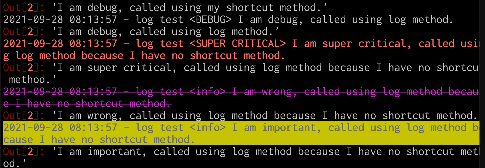

pysimplelogを使ってロギングしてみよう
=================

## pysimplelog について
simplelog は名前のとおり、Python で実装された非常にシンプルで完全なロギングライブラリです。2つのストリームに同時にロギングすることができます。1つ目はデフォルトでシステムの標準出力で、2つ目はファイルに設定されるように指定されています。さらに、pysimplelogは、ストリームが許可する場合、テキストの色付けと属性を有効にします。

## インストール
pysimplelog は pip コマンドで次のようにインストールします。

 bash
```
 $ pip install pysimpelog
```

## pysimplelog の使用方法概要
まずは、ロガーを取得して、ロギングを行いましょう。


```
 In [2]: # %load 01_intro.py
    ...: from pysimplelog import Logger
    ...:
    ...: logger = Logger()
    ...:
    ...: logger.info('I am an info')
    ...: logger.warn('I am a warning')
    ...: logger.error('I am an error')
    ...:
 2021-09-28 07:25:33 - logger <INFO> I am an info
 Out[2]: 'I am an info'
 2021-09-28 07:25:33 - logger <WARNING> I am a warning
 Out[2]: 'I am a warning'
 2021-09-28 07:25:33 - logger <ERROR> I am an error
 Out[2]: 'I am an error'

```

２つの出力先に送出されているのがわかります。
ロガーを `print()` で出力する（つまり、 `__repr__()` を呼び出す）と、ロガーの設定状況を確認できます。


```
 In [2]: # %load 02_logger.py
    ...: from pysimplelog import Logger
    ...:
    ...: logger = Logger()
    ...: print(logger)
    ...:
 Logger (Version 4.0.0)
  - Log To Stdout: Flag (True) - Min Level (None) - Max Level (None)
  - Log To File:   Flag (True) - Min Level (None) - Max Level (None)
                   File Size (10.0) - First Number (0) - Roll (None)
                   Current log file (simplelog_0.log)
 log type  |log name  |level     |std flag  |file flag |
 ----------|----------|----------|----------|----------|
 debug     |DEBUG     |0.0       |True      |True      |
 info      |INFO      |10.0      |True      |True      |
 warn      |WARNING   |20.0      |True      |True      |
 error     |ERROR     |30.0      |True      |True      |
 critical  |CRITICAL  |100.0     |True      |True      |

```

これをみてわかるように、pysimpleiog はロギングに情報をストレスなく参照することができるゆにされています。
こにことは、結果的に使いやすいライブラリとなっているわけです。

 bash
```
 % cat simplelog_0.log
 2021-09-28 07:29:50 - demo <INFO> I am an info
 2021-09-28 07:29:50 - demo <WARNING> I am a warning
 2021-09-28 07:29:50 - demo <ERROR> I am an error

```

## ログファイル名の変更とログ対応の追加・修正

前述の例では、デフォルトの設定を使いました。
次のコードでは、ログファイルの名前を  `mylog.pylog` に変更して、新規のログ対応を追加、error ログタイプの内容を更新しています。


```
 In [2]: # %load mylogger.py
    ...: from pysimplelog import Logger
    ...:
    ...: # 初期化
    ...: logger = Logger("log test")
    ...:
    ...: # ログファイル名を設定
    ...: logger.set_log_file_basename("mylog")
    ...:
    ...: # ログファイルの拡張子を設定
    ...: logger.set_log_file_extension("pylog")
    ...:
    ...: # 新規のログタイプを追加
    ...: logger.add_log_type("super critical",
    ...:                name="SUPER CRITICAL", level=200, color='red',
    ...:                attributes=["bold","underline"])
    ...: logger.add_log_type("wrong",
    ...:                name="info", color='magenta',
    ...:                attributes=["strike through"])
    ...: logger.add_log_type("important",
    ...:                name="info", color='black', highlight="orange",
    ...:                attributes=["bold"])
    ...:
    ...: # error ログタイプ を更新
    ...: logger.update_log_type(logType='error', color='pink',
    ...:                   attributes=['underline','bold'])
    ...:
    ...: if __name__ == '__main__':
    ...:     print(logger)
    ...:
 Logger (Version 4.0.0)
  - Log To Stdout: Flag (True) - Min Level (None) - Max Level (None)
  - Log To File:   Flag (True) - Min Level (None) - Max Level (None)
                   File Size (10.0) - First Number (0) - Roll (None)
                   Current log file (mylog_0.pylog)
 log type       |log name       |level     |std flag  |file flag |
 ---------------|---------------|----------|----------|----------|
 debug          |DEBUG          |0.0       |True      |True      |
 wrong          |info           |0.0       |True      |True      |
 important      |info           |0.0       |True      |True      |
 info           |INFO           |10.0      |True      |True      |
 warn           |WARNING        |20.0      |True      |True      |
 error          |ERROR          |30.0      |True      |True      |
 critical       |CRITICAL       |100.0     |True      |True      |
 super critical |SUPER CRITICAL |200.0     |True      |True      |

```

追加・修正したログタイプは、 `log()` メソッドから使用することができます。


```
 In [2]: # %load 03_new_logtype.py
    ...: from mylogger import logger
    ...:
    ...: logger.info("I am info, called using my shortcut method.")
    ...: logger.log("info", "I am  info, called using log method.")
    ...:
    ...: logger.warn("I am warn, called using my shortcut method.")
    ...: logger.log("warn", "I am warn, called using log method.")
    ...:
    ...: logger.error("I am error, called using my shortcut method.")
    ...: logger.log("error", "I am error, called using log method.")
    ...:
    ...: logger.critical("I am critical, called using my shortcut method.")
    ...: logger.log("critical", "I am critical, called using log method.")
    ...:
    ...: logger.debug("I am debug, called using my shortcut method.")
    ...: logger.log("debug", "I am debug, called using log method.")
    ...:
    ...: logger.log("super critical",
    ...:            "I am super critical, called using log method "
    ...:            "because I have no shortcut method.")
    ...: logger.log("wrong",
    ...:            "I am wrong, called using log method "
    ...:            "because I have no shortcut method.")
    ...: logger.log("important",
    ...:            "I am important, called using log method "
    ...:            "because I have no shortcut method.")
    ...:
 2021-09-28 08:13:57 - log test <INFO> I am info, called using my shortcut method.
 Out[2]: 'I am info, called using my shortcut method.'
 2021-09-28 08:13:57 - log test <INFO> I am  info, called using log method.
 Out[2]: 'I am  info, called using log method.'
 2021-09-28 08:13:57 - log test <WARNING> I am warn, called using my shortcut method.
 Out[2]: 'I am warn, called using my shortcut method.'
 2021-09-28 08:13:57 - log test <WARNING> I am warn, called using log method.
 Out[2]: 'I am warn, called using log method.'
 2021-09-28 08:13:57 - log test <ERROR> I am error, called using my shortcut method.
 Out[2]: 'I am error, called using my shortcut method.'
 2021-09-28 08:13:57 - log test <ERROR> I am error, called using log method.
 Out[2]: 'I am error, called using log method.'
 2021-09-28 08:13:57 - log test <CRITICAL> I am critical, called using my shortcut method.
 Out[2]: 'I am critical, called using my shortcut method.'
 2021-09-28 08:13:57 - log test <CRITICAL> I am critical, called using log method.
 Out[2]: 'I am critical, called using log method.'
 2021-09-28 08:13:57 - log test <DEBUG> I am debug, called using my shortcut method.
 Out[2]: 'I am debug, called using my shortcut method.'
 2021-09-28 08:13:57 - log test <DEBUG> I am debug, called using log method.
 Out[2]: 'I am debug, called using log method.'
 2021-09-28 08:13:57 - log test <SUPER CRITICAL> I am super critical, called using log method because I have no shortcut method.
 Out[2]: 'I am super critical, called using log method because I have no shortcut method.'
 2021-09-28 08:13:57 - log test <info> I am wrong, called using log method because I have no shortcut method.
 Out[2]: 'I am wrong, called using log method because I have no shortcut method.'
 2021-09-28 08:13:57 - log test <info> I am important, called using log method because I have no shortcut method.
 Out[2]: 'I am important, called using log method because I have no shortcut method.'

```

出力をコピー＆ペーストしただけなので、紙面の都合上単なる出力になっていますが、実際には標準出力へはカラー表示がされています。



## 直近のログを出力


```
 In [1]: %run 03_new_logtype.py

 In [2]: %load 04_last_logged_msg.py

 In [3]: # %load 04_last_logged_msg.py
    ...: from mylogger import logger
    ...:
    ...: # 直近にログされたメッセージを出力
    ...: print("")
    ...: print("Last logged messages are:")
    ...: print("=========================")
    ...: print(logger.lastLoggedMessage)
    ...: print(logger.lastLoggedDebug)
    ...: print(logger.lastLoggedInfo)
    ...: print(logger.lastLoggedWarning)
    ...: print(logger.lastLoggedError)
    ...: print(logger.lastLoggedCritical)
    ...:

 Last logged messages are:
 =========================
 2021-09-28 08:30:04 - log test <info> I am important, called using log method because I have no shortcut method.
 2021-09-28 08:30:04 - log test <DEBUG> I am debug, called using log method.
 2021-09-28 08:30:04 - log test <INFO> I am  info, called using log method.
 2021-09-28 08:30:04 - log test <WARNING> I am warn, called using log method.
 2021-09-28 08:30:04 - log test <ERROR> I am error, called using log method.
 2021-09-28 08:30:04 - log test <CRITICAL> I am critical, called using log method.

```

## データをログ
データの内容を出力することができます。


```
 In [2]: # %load 05_checkoout_data.py
    ...: from mylogger import logger
    ...:
    ...: # データをログ
    ...: logger.info("Check out this data", data=list(range(10)))
    ...:
 2021-09-28 08:34:38 - log test <INFO> Check out this data
 [0, 1, 2, 3, 4, 5, 6, 7, 8, 9]
 Out[2]: 'Check out this data'

```

## トレースバックをログに出力

例外を捕獲して、トレースバックメッセージをログすることもできます。


```
 In [2]: # %load 06_traceback.py
    ...: from mylogger import logger
    ...:
    ...: # トレースバックをロギング
    ...: import traceback
    ...: try:
    ...:     1/range(10)
    ...: except Exception as err:
    ...:     logger.error(f'{err} (is this python ?)',
    ...:                  tback=traceback.extract_stack())
    ...:
 2021-09-28 08:36:01 - log test <ERROR> unsupported operand type(s) for /: 'int' and 'range' (is this python ?)
 (中略)
 Out[2]: "unsupported operand type(s) for /: 'int' and 'range' (is this python ?)"

```


## pysimplelog の実装の仕組み
pysimplelog はひとつの’  `site-packages/pysimplelog/SimpleLog.py` に２つのクラスが定義されています。

- Logger：simplelogのメインとなるLoggerクラスの定義
- SingleLogger：アプリケーションから利用する場合はこちらを利用する

アプリケーションから利用する場合、オーバーロードする必要がないのであれば、次のように使用します。


```
 from pysimplelog import SingleLogger as Logger
```

Logger を拡張したいのであれば、次のようにします。


```
 In [2]: # %load 07_custom_init.py
    ...: from pysimplelog import SingleLogger as LOG
    ...:
    ...: class Logger(LOG):
    ...:     def custom_init(self, *args, **kwargs):
    ...:         # 必要に応じてここに何かコードを追加
    ...:         pass
    ...:
    ...:
    ...: # help(Logger)
    ...:

```

 `__init__()` をオーバーロードする必要がある場合は、このようにすることができます。


```
 In [2]: # %load 08_init_overload.py
    ...: from pysimplelog import SingleLogger as LOG
    ...:
    ...: class Logger(LOG):
    ...:     def __init__(self, *args, **kwargs):
    ...:         if self._isInitialized: return
    ...:         super(Logger, self).__init__(*args, **kwargs)
    ...:         # 必要に応じてここに何かコードを追加
    ...:

```

### コンストラクタの引数
- name（文字列）。ロガーの名前です。
- flush (boolean)：ロガーの名前。ロギングストリームを常にフラッシュするかどうか。
- logToStdout（ブール値）。標準出力ストリームにログを出力するかどうか。
- stdout (None, stream): 標準出力ストリームです。Noneの場合は、システム標準出力が自動的に設定されます。それ以外の場合は、readおよびwriteメソッドを持つ任意のストリームを渡すことができます。
- logToFile（ブール値）。ファイルにログを記録するかどうか。
- logFile (None, string): ディレクトリのベースネームと拡張子を含む完全なログファイルのパス。これが与えられると、logFileBasenameとlogFileExtensionのすべてが破棄されます。logfileはlogFileBasename.logFileExtensionと同等です。
- logFileBasename（文字列）。ロギングファイルのディレクトリパスとファイルのベースネーム。ログファイルのフルネームは logFileBasename.logFileExtension として設定されます。
- logFileExtension（文字列）。ロギングファイルの拡張子。ロギングファイルのフルネームは logFileBasename.logFileExtension として設定されます。
- logFileMaxSize（なし、数値）。ロギングファイルの最大サイズ（メガバイト）。この値を超えると、logFileBasename_N.logFileExtension として別のロギング ファイルが作成されます。N は自動的に増加する数値です。None または負の数が指定された場合、ログファイルは無限に増加します。
- logFileFirstNumber（なし、整数）： logFileBasename_N.logFileExtension 内の最初のログファイル番号 'N' です。None が指定された場合、最初のログファイルは logFileBasename.logFileExtension となり、logFileMaxSize に達すると 2 番目のログファイルは logFileBasename_0.logFileExtension となります。番号を指定する場合は、整数≧0でなければなりません。
- logFileRoll (None, intger): 与えられた場合、書き込むログファイルの最大数を設定します。この数を超えると、以前のファイルが削除されます。これにより、ファイル数が常に増加することも保証されます。
- stdoutMinLevel(None, number): システムの標準出力レベルに記録する最小のログを指定します。Noneの場合、標準出力の最小レベルのチェックは行われません。
- stdoutMaxLevel(None, number): システム標準出力レベルへのロギングの最大値。Noneの場合、標準出力の最大レベルのチェックは行われない。
- fileMinLevel(None, number): ファイルレベルへの最小ロギング。Noneの場合、ファイルの最小レベルのチェックは行われない。
- fileMaxLevel(None, number): fileMaxLevel(None, number): ファイルへのロギングレベルの最大値。Noneの場合、ファイルの最大レベルのチェックは行われない。
- logTypes (None, dict): 既存のログタイプの作成と更新に使用されます。初期化時に既存のログタイプを作成・更新するために使用します。与えられた辞書のキーはlogType（新規または既存）で、値はNoneまたはupdate_log_typeを呼び出すためのkwargsの辞書になります。この引数はcustom_initの後に呼び出されます。
- timezone (None, str)。ロギングの時間帯を指定します。指定する場合は、pytzがインストールされていて、タイムゾーン名である必要があります。指定しない場合は、マシンのデフォルトのタイムゾーンが使われます。
- *args: これは、初期化をカスタマイズするために、キーワードではない可変長の引数リストを送信するために使用されます。
- argsは解析され、custom_initメソッドで使用されます。
- **kwargs: キーワード付きの可変長引数リストをcustom_initメソッドに渡すことができます。
- kwargsには__init__引数以外のものを指定できます。


## 参考
- [pysimplelog ドキュメント ](https://bachiraoun.github.io/pysimplelog/)
- [pysimplelog ソースコード ](https://github.com/bachiraoun/pysimplelog/)

#ロギング


