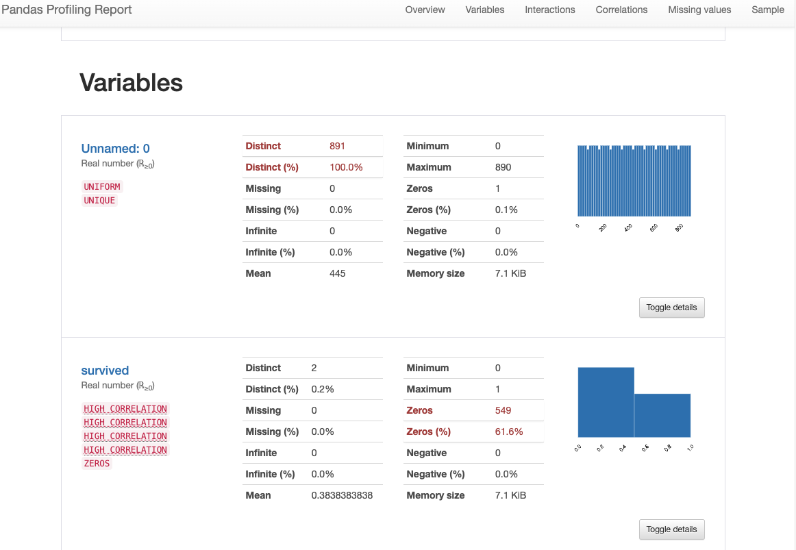

Pandas-Profilingで探査的データ分析をしてみよう
=================


# Panda-Profiling について
Pandas Profiling は、2016年から開発されているオープンソースのPythonモジュールで、わずか数行のコードで探索的データ分析を迅速に行うことができます。また、こ生成するレポートは、プログラミングを知らない人にも見せることができるインタラクティブなWeb形式のものです。pandas-profiling が出力するのはHTMLオブジェクトひとつだけです。ただし、そこには、より具体的で個別のデータ探索を行う前に知っておくべき情報がほとんど含まれていて、広範囲に構造化されたHTMLファイルを素早く生成するようになっています。


# インストール

 bash
```
 $ python -m pip install -U "pandas-profiling[notebook]"
```

Jupyterlab の環境で実行する場合は、次のように Jupyterlab の拡張機能もインストールしておきます。

 bash
```
 $ jupyter nbextension enable --py widgetsnbextension
```

# 学習用データセット
pandas-profiling には、学習用のデータセットが内包されていません。dataprep が持っているデータセットを使うこともできますが、同様のライブラリをインストールすることになってしまます。 pandas-profiling に依存してインストールされる可視化ライブラリ seaborn には学習用のデータセットが内包されているのでこれを利用することにしましょう。ヘルパー関数　 `load_dataset()` 　にデータセット名を与えるとDataFrameで返してくれます。


```
 In [2]: # %load c01_dataset_titanic.py
    ...: import pandas as pd
    ...: import seaborn as sns
    ...:
    ...: v1 = sns.get_dataset_names()
    ...: df = sns.load_dataset('titanic')
    ...: df.to_csv('titanic.csv')
    ...:
    ...: # v1
    ...: # df
    ...:
    ...:

 In [3]: v1
 Out[3]:
 ['anagrams',
  'anscombe',
  'attention',
  'brain_networks',
  'car_crashes',
  'diamonds',
  'dots',
  'exercise',
  'flights',
  'fmri',
  'gammas',
  'geyser',
  'iris',
  'mpg',
  'penguins',
  'planets',
  'taxis',
  'tips',
  'titanic']

 In [4]: df
 Out[4]:
      survived  pclass     sex   age  ...  deck  embark_town  alive  alone
 0           0       3    male  22.0  ...   NaN  Southampton     no  False
 1           1       1  female  38.0  ...     C    Cherbourg    yes  False
 2           1       3  female  26.0  ...   NaN  Southampton    yes   True
 3           1       1  female  35.0  ...     C  Southampton    yes  False
 4           0       3    male  35.0  ...   NaN  Southampton     no   True
 ..        ...     ...     ...   ...  ...   ...          ...    ...    ...
 886         0       2    male  27.0  ...   NaN  Southampton     no   True
 887         1       1  female  19.0  ...     B  Southampton    yes   True
 888         0       3  female   NaN  ...   NaN  Southampton     no  False
 889         1       1    male  26.0  ...     C    Cherbourg    yes   True
 890         0       3    male  32.0  ...   NaN   Queenstown     no   True

 [891 rows x 15 columns]

 In [5]: df.describe()
 Out[5]:
          survived      pclass         age       sibsp       parch        fare
 count  891.000000  891.000000  714.000000  891.000000  891.000000  891.000000
 mean     0.383838    2.308642   29.699118    0.523008    0.381594   32.204208
 std      0.486592    0.836071   14.526497    1.102743    0.806057   49.693429
 min      0.000000    1.000000    0.420000    0.000000    0.000000    0.000000
 25%      0.000000    2.000000   20.125000    0.000000    0.000000    7.910400
 50%      0.000000    3.000000   28.000000    0.000000    0.000000   14.454200
 75%      1.000000    3.000000   38.000000    1.000000    0.000000   31.000000
 max      1.000000    3.000000   80.000000    8.000000    6.000000  512.329200

 In [6]:

```


# Pandas-Profiling でのデータ探索
DataFrame の  `.describe()` を呼び出せば基本的な統計量を知ることができます。これを、pandas-profiling を使うと、もっと魅力的なレポートを作成することができます。

Jupyterlab の環境では次のように実行するだけです。


```
 import pandas as pd
 from pandas_profiling import ProfileReport

 df = pd.read_csv('titanic.csv')


 # for Jupyterlab
 profile = ProfileReport(df)
 profile

```

これでHTMLがノートブックに取り込まれて表示されます。基本的にはこれでOKなのですが、データによってはエラーになることがあります。その場合は次のようにしてみてください。(参考 [issue #954  ](https://github.com/ydataai/pandas-profiling/issues/954#issuecomment-1103833073))

IPythonなどでは、 `to_file()` メソッドを呼び出してHTMLファイルとして保存しておきます。


```
 In [2]: # %load c03_profiling_ipython.py
    ...: import pandas as pd
    ...: from pandas_profiling import ProfileReport
    ...:
    ...: df = pd.read_csv('titanic.csv')
    ...:
    ...: profile = ProfileReport(df,
    ...:                  vars={"num": {"low_categorical_threshold": 0}})
    ...: profile.to_file('titanic.html')
    ...:
 Summarize dataset: 100%|██████████████| 80/80 [00:32<00:00,  2.45it/s, Completed]
 Generate report structure: 100%|███████████████████| 1/1 [00:17<00:00, 17.65s/it]
 Render HTML: 100%|█████████████████████████████████| 1/1 [00:12<00:00, 12.75s/it]
 Export report to file: 100%|███████████████████████| 1/1 [00:00<00:00, 22.33it/s]

 In [3]:

```

あとは、ブラウザでオープンするか、Pythonのコードで処理したいときは標準ライブラリ webbrowser を使ってブラウザを起動させてレポートを開くこともできます。


```
 In [2]: # %load c04_open_browser.py
    ...: import webbrowser
    ...: from pathlib import Path
    ...:
    ...: html = Path('titanic.html')
    ...: url = 'file://' + str(html.absolute())
    ...: _ = webbrowser.open_new(url)
    ...:

 In [3]:

```





これらの結果はオフィシャルサイトでも[公開 ](https://pandas-profiling.ydata.ai/examples/master/titanic/titanic_report.html) しているように、簡単にWEBで共有することができます。


## Pandas Profilingの弱点
Pandas Profiling の弱点としては、次の2つが挙げられます。

- 　**遅い**  Pandas Profiling でのEDAは、 データセット全体のプロファイルを作成するためレポートの作成に時間がかかります。これは、大規模なデータセットでは顕著で、データサイズの増加に伴いレポート生成にかかる時間も大幅に増加します。
- 　**アウトオブコア計算ができない**　内部で使用している Pandas の制限から、メモリ上に展開できないデータセットについては分析できません。
- 　**データクリーニングをサポートしていない**　Pandas-Profiling はEDAの機能を提供するだけです。このため、EDAにより得た知見をもとにデータクリーニングをするときは、Pandas を使って手間のかかる作業をすることになってしまうことになります。


# まとめ

2016年から開発が始まり広く知られているライブラリですが、大規模データを扱えないことや、クリーニングなどの工程に対応できていないことに注意が’必要です。


# 参考
- Panda-Profiling
- DataPrep
  - [DAtaPrep での分析サンプル ](https://docs.dataprep.ai/_downloads/1a61c6aebb3ecbe9dc9742bd6ca78ddb/titanic_dp.html)
  - [DAtaPrep での分析サンプル ](https://docs.dataprep.ai/_downloads/1a61c6aebb3ecbe9dc9742bd6ca78ddb/titanic_dp.html)
- PythonOsaka
  - [DataPrepで探査的データ分析をしてみよう]

#EDA


