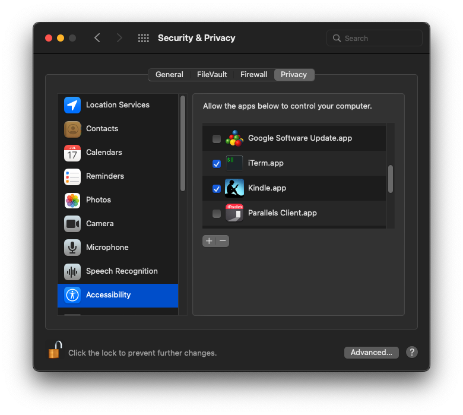
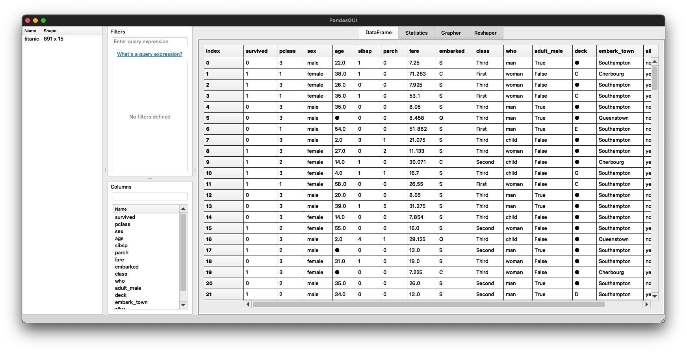
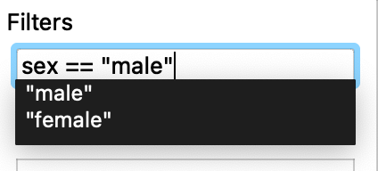
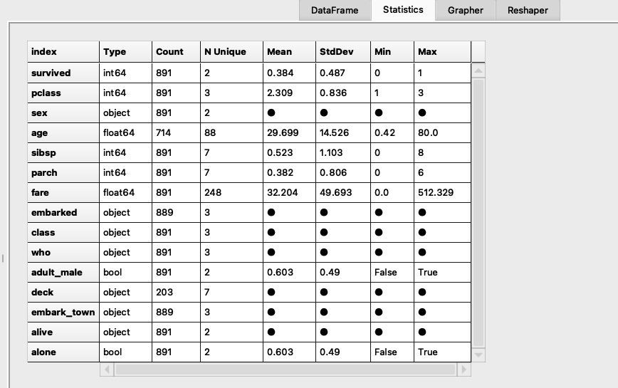
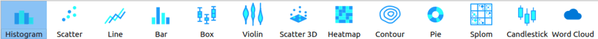
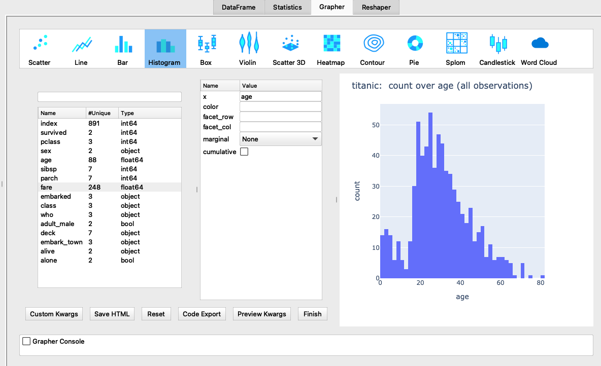
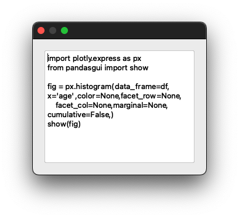

PandasGUIで探査的データ分析をしてみよう
=================


## PandasGUIについて
[PandasGUI ](https://pypi.org/project/pandasgui/) は、Pandas にグラフィカルユーザインタフェース(GUI) を提供するアプリケーションとライブラリで、マウスをクリックするだけでpandasのデータフレームにアクセスしたり、操作することができます。

次のような機能をもっています。

  - データフレームとシリーズの表示と並べ替え（マルチインデックス対応）
  - インタラクティブなグラフ描画
  - フィルタリング（クエリ式を使用することもOK)
  - １クリックでの統計概要
  - データ編集、コピー/ペースト
  - ドラッグ＆ドロップによるCSVファイルの読み込み
  - 検索ツールバー
  - Jupyter notebook / Jupyterlab との連携

## インストール
PandasGUI は pip コマンドでインストールすることができます。

 bash
```
 $ pip install pandasgui
```

内部で使用している [Consolas Font http://www.fontpalace.com/font-details/Consolas/] がプラットフォームにインストールされていない場合は、次の手順でインストールできます。

    - [Consolas Font http://www.fontpalace.com/font-details/Consolas/] をダウンロード
    -  `Consolas.ttf` をダブルクリック
    - 対応アプリケーション（MacOSの場合はFont Book ）が起動されます
    - [# Install font] をクリック

このフォントがなくてもワーニングメッセージが表示されるだけなので任意です
> `qt.qpa.fonts: Populating font family aliases took 524 ms. Replace uses of missing font family "Consolas" with one that exists to avoid this cost.`


まずは、簡単なデモをみてましょう。

c01_demo.py
```
import pandas as pd
from pandasgui import show

df = pd.DataFrame({'a':[1,2,3], 'b':[4,5,6], 'c':[7,8,9]})
show(df)
```


PandasGUIには既にいくつかのサンプルデータセットが付属しています。


```
In [2]: # %load c01_dataset.py
    ...: from pandasgui.datasets import all_datasets
    ...:
    ...: datasets = all_datasets.keys()
    ...: print(datasets)
    ...:
 odict_keys(['pokemon', 'googleplaystore', 'googleplaystore_reviews', 'netflix_titles', 'trump_tweets', 'harry_potter_characters', 'happiness', 'country_indicators', 'us_shooting_incidents', 'stockdata', 'gapminder', 'anscombe', 'attention', 'brain_networks', 'diamonds', 'dots', 'exercise', 'flights', 'fmri', 'gammas', 'geyser', 'iris', 'mpg', 'penguins', 'planets', 'tips', 'titanic', 'seinfeld_episodes', 'seinfeld_scripts', 'mi_manufacturing', 'simple', 'multiindex', 'small', 'unhashable'])

In [3]:

```

> [! 補足説明] macOSでiTermなど標準のターミナル以外を利用しているときは、次のメッセージが表示されることがあります。
>   `This process is not trusted! Input event monitoring will not be possible until it is added to accessibility clients.` は macOS 固有のものですが、これは無視することができますが、気になる場合は、[# System Preference] ー＞[# Security & Privacy] ー＞ [# Privacy] で、[# Accessibility] から該当アプリケーション（次のスクリーンショットの場合は　iTerm.app) にチェックをいれてください。
>



機械学習の分野では有名なTitanicデータセットを使ってPandasGUI を実行してみましょう。
コードは驚くほど簡単です。

c02_titanic.py
```
from pandasgui import show
from pandasgui.datasets import titanic

gui = show(titanic)
```

データセットは複数与えることができます。また、データフレームをGUIインターフェースにドラッグするだけでインポートすることができます。

PandasGUIのアプリケーションが起動して、初めの画面ではデータフレームの内容が表示されます。



#### 既知の問題
データフレームの列数が多くてデータフレームの表示がウィンドウ内に収まらない ときに、Python 3.10 では次のようなエラーが出力されます。　これは[# Filter]関連のボタンをうまく配置できないだけなので、実用上は無視できます。


```
 TypeError                                 Traceback (most recent call last)
 File ~/anaconda3/envs/EDA/lib/python3.1/site-packages/pandasgui/widgets/find_toolbar.py:308, in ButtonLineEdit.resizeEvent(self, event)
     306 for i, button in enumerate(self.buttons):
     307     buttonSize = button.sizeHint()
 --> 308     button.move(
     309         self.rect().right()
     310         - frameWidth
     311         - buttonSize.width() * (i + 1)
     312         - right_margin,
     313         (self.rect().bottom() - buttonSize.height() + 1) / 2 - bottom_margin,
     314     )
     315 super(ButtonLineEdit, self).resizeEvent(event)

 TypeError: arguments did not match any overloaded call:
   move(self, QPoint): argument 1 has unexpected type 'int'
   move(self, int, int): argument 2 has unexpected type 'float'

```

このウィンドウの上部に次の4つのタブボタンが配置されていて、処理したいボタンをクリックします。

  - DateFrame　ー　読み込んだデータフレームの内容が表示される
  - Filters　ー　フィルタリングしたい内容を入力
  - Statistics　ー　統計的なデータを表示する
  - Grapher　ー　グラフ作成が可能
  - Reshaper　ー　pivot(ピボット)/melt(溶かす)などデータ整理を行う

Filterでは列名と条件式でデータフレームをフィルターすることができます。たとえば、男性乗客だけのデータを見たいときは次のようにフィルターを設定します。



ここで、データ内容にしたがって候補がでていることに注目してください。条件式をキーボードから入力してリターンキーを謳歌するとフィルターが登録されます。登録したフィルターの先頭にチェックボックが付加されていて、これをチェック/アンチェックすることでそのフィルターの有効/無効を支持することができます。

条件式ではPython式が使えます。次のようなものが使用することができます。

  - 男性乗客以外：　 `sex != "age"`
  - 年齢が20歳以上：  `age >= 20`
  - 年齢が20歳以上60歳以下：　 `age >= 20 & age <= 60` あるいは  `age.between(20, 60)`
  - 年生が20歳以下もしくは女性乗客：  `age <= 20 | sex == "female"`
  - 年齢が空白のデータ： `age.isnull()`
  - 年齢が空白でないデータ： `~age.isnull()`




[# Grapher] をクリックするとデータフレームの可視化することができます。データフレームのカラムリストからX軸とY軸を割り当てて（ドラッグ＆ドロップ）プロットを表示させることができます。
可視化処理では内部でplotlyやBokhが使われています。


プロットタイプを変更するときもアイコンをクリックするだけです。（データがそのプロットタイプに対応しる必要があります)






下部にある[# Code Export] ボタンをクリックすると、そのプロットを表示するための Python コードがポップアップウィンドウに表示されます。

[# Reshaper] をクリックすると、データフレームを加工することができます。





# デモ動画
[](https://www.youtube.com/watch?v=NKXdolMxW2Y)


# まとめ
PandasGUIを利用するとノーコードでデータフレームのフィルタリングやマージ（Merge)や結合、ピボットテーブルなどのデータ操作や、可視化をノーコードで実現することができます。また、PandasGUIで操作した処理に該当する Pythonコードを表示させることもでき、初心者で学習にも向いているアプリケーションです。
’

# 参考
- PandasGUI
  - [PyPI - PandasGUI ](https://pypi.org/project/pandasgui/)
  - [ソースコード ](https://github.com/adrotog/PandasGUI)

#Pandas


