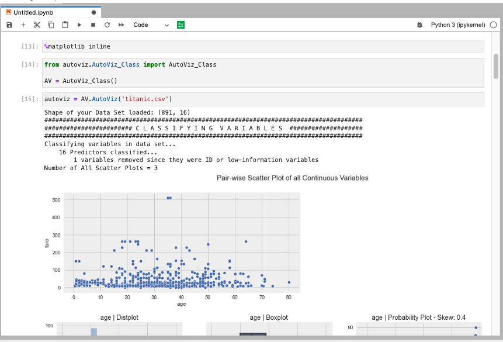
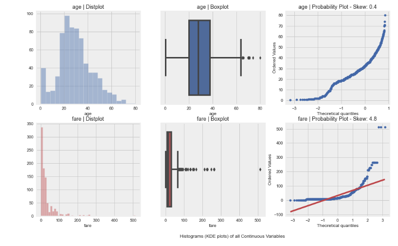
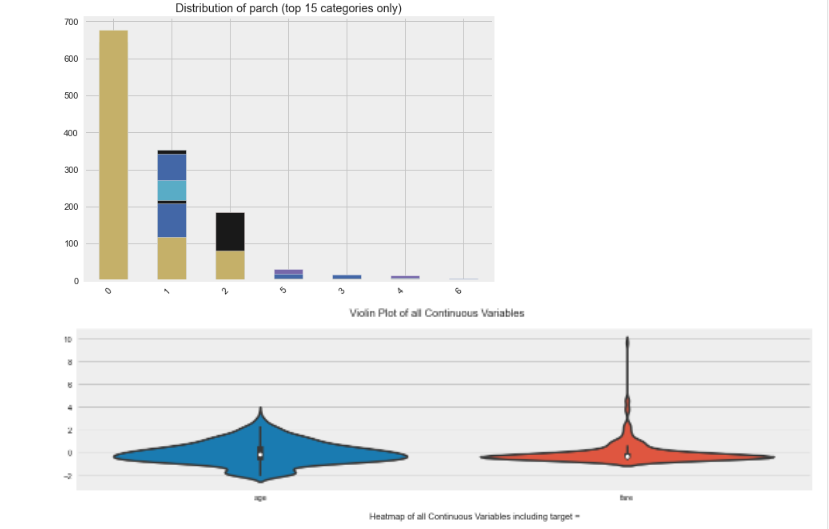
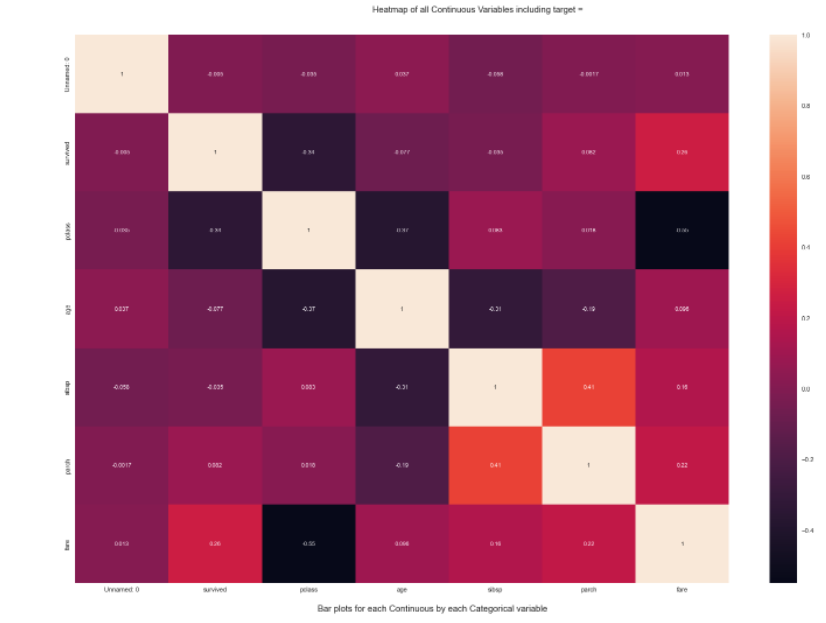
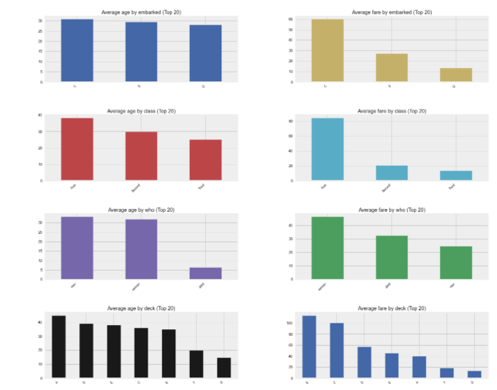
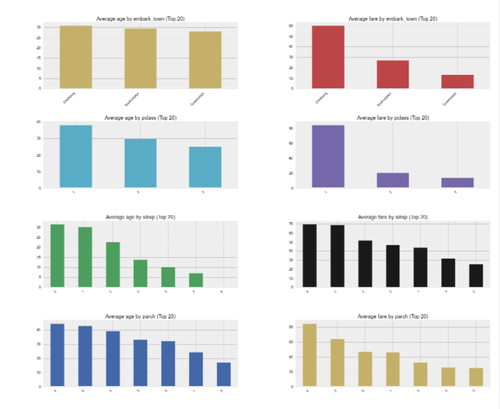

AutoVizで探査的データ分析をしてみよう
=================


# はじめに
この資料はAutoViz についてまとめたものです。

# AutoViz について
小さなデータセットの可視化は簡単でそれほど問題になることはありませんが、数百の変数を持つ大規模なデータセットでは、可視化をすることなくデータセットから強調すべき最良の特徴量を決定することはほぼ不可能です。データ分析を行う環境によっては、標準的でない可視化ライブラリを使用しなければならず、適切な知見を得るための可視化を行うにはかなりのコーディングが必要となることが多いものです。
[Autoviz ](https://pypi.org/project/autoviz/) は、データ可視化のための作業を行うときに発生しうる、これらさまざまな課題の多くに対処しています。このツールは、pandasのDataFrameオブジェクトや、CSVファイルのいずれかを与える、1行のコードで実現することができます。


# インストール
AutoViz は次のようにインストールすることができます。

 bash
```
 $ python -m pip install autoviz

```

# 使用方法

残念ながら AutoViz には学習用のデータセットが内包されていません。
次のコードでタイタニックのデータセットをダウンロードしておきます。


```
 In [2]: # %load c01_dataset.py
    ...: import pandas as pd
    ...:
    ...: _baseurl = 'https://raw.githubusercontent.com/adamerose/datasets/master
    ...: /'
    ...: dataset_url = _baseurl + 'titanic.csv'
    ...: df = pd.read_csv( dataset_url )
    ...:
    ...: df.to_csv('titanic.csv')
    ...:

 In [3]:

```

あるいは、次のようなモジュール用意しておくのもよいでしょう。

 datasets.py
```
 import pandas as pd
 from urllib.error import HTTPError

 class DatasetError(BaseException):
     pass

 class DataSet(object):
     baseurl = 'https://raw.githubusercontent.com/adamerose/datasets/master/'
     dataset_names = [
         'anscombe.csv',
         'attention.csv',
         'brain_networks.csv',
         'country_indicators.csv',
         'diamonds.csv',
         'dots.csv',
         'exercise.csv',
         'flights.csv',
         'fmri.csv',
         'gammas.csv',
         'gapminder.csv',
         'geyser.csv',
         'googleplaystore.csv',
         'googleplaystore_reviews.csv',
         'happiness.csv',
         'harry_potter_characters.csv',
         'iris.csv',
         'mi_manufacturing.csv',
         'mpg.csv',
         'netflix_titles.csv',
         'penguins.csv',
         'planets.csv',
         'pokemon.csv',
         'reddit_showerthoughts_may2015.csv',
         'seinfeld_episodes.csv',
         'seinfeld_scripts.csv',
         'stockdata.csv',
         'tips.csv',
         'titanic.csv',
         'trump_tweets.csv',
         'us_shooting_incidents.csv',
     ]

     def load_dataset(self, name, save=False):
         try:
             assert name in self.dataset_names
             exists_flag = Path(name).exists()
             if exists_flag:
                 url = 'file://' + str(Path(name).absolute())
             else:
                 url = self.baseurl + name
             df = pd.read_csv( url )
             _ = save and not exists_flag and df.to_csv(name)
             return df
         except AssertionError:
             raise DatasetError('dataset not available') from None
         except HTTPError as err:
             raise DatasetError(err)

     def get_dataset_names(self):
         return self.dataset_names

 dataset = DataSet()
 load_dataset = dataset.load_dataset
 get_dataset_names = dataset.get_dataset_names

 if __name__ == '__main__':
     import sys
     if len(sys.argv)<=1:
         from pprint import pprint
         pprint(get_dataset_names())
     else:
         _= load_dataset(sys.argv[1], save=True)

```

 bash
```
 $ python datasets.py titanic.csv
```

AutoViz を利用するためには、プロットをインラインで表示させるためのマジックコマンドをJupyterlab のセルで実行しておく必要があります。


```
 %matplotlib inline
```

また、matplotlib のフォント設定を日本語化する必要があれば、次のモジュールをインストールしてインポートしておきます。

 bash
```
 !pip install japanize_matplotlib
 import japanize_matplotlib
```


AutoViz を初期化するために次のコードを実行します。


```
 from autoviz.AutoViz_Class import AutoViz_Class
 AV = AutoViz_Class()
```

あとは、次の1行でEDAのプロットがノートブックに表示されます。


```
 autoviz = AV.AutoViz('titanic.csv')
```

これだけで次のプロットが表示されます。はじめのプロットでは、カラムのサマリーが表示されます。
インタージャー、カテゴリー、ストリンカラムの数などについても表示されます。

2番目のプロットは、すべての連続変数のペアワイズ散布図になります。もし、複数の連続変数があれば、autovizは複数のペアワイズ・プロットを作成します。ここでは、2つの連続変数fareとageがあります。




3番目のグラフは、連続変数の分布プロットです。このプロットは、boxplotを使用して外れ値を見つけることができ、またデータが歪んでいるかどうかを見つけることができます。




4番目のグラフは、すべての連続変数のバイオリン・プロットが表示されます（上図参照）。

5 番目の図は、すべての変数の相関をヒートマップで表したもので、相関プロットにより、さまざまな変数の共線性を見つけることができます。



6番目の図は、すべてのカテゴリ変数によってグループ化された連続値を可視化されます。これは、意味のある洞察を得る手助けになります。




# カスタマイズ

 `AutoViz()` にファイル名を与えるのではなくデータフレームを渡したいときは、 `filename` を空にして、 `dfte` にデータフレームを与えます。
具体的には、次のようなコードになります。


```
 rom autoviz.AutoViz_Class import AutoViz_Class
 from dataset import load_dataset

 df = load_dataset('titanic.csv')

 AV = AutoViz_Class()

 dft = AV.AutoViz(
     filename="",
     sep=",",
     depVar="",
     dfte=df,
     header=0,
     verbose=0,
     lowess=False,
     chart_format="bokeh",
     max_rows_analyzed=150000,
     max_cols_analyzed=30,
     save_plot_dir=None
 )

```

# API
 `AutoViz()` は次の引数を受け取ります。

>  `AutoViz(filename, sep=',', depVar='', dfte=None, header=0, verbose=0, lowess=False, chart_format='svg', max_rows_analyzed=150000, max_cols_analyzed=30, save_plot_dir=None) `

  -  `filename` ー　 `filename` にはデータが格納されたファイル名もしくkはが空文字列（ `""` ）を受け取ります。もしファイル名ではなく、単にデータフレームを渡したいときは、 `dfte` でデータフレームの変数を与えます。
  -  `sep` ー　ファイル内の区切り文字です。デフォルトはカンマ( `,` )です。他にセミコロン( `;` )やタブなどファイル内で各列を区切る任意の値を指定することができます。
  -  `depVar` ー　データセットのターゲット変数．データ中にターゲット変数がない場合は、空文字列( `""` )を与えます。
  -  `dfte` ー　pandas のデータフレームを読み込んでグラフを作成する場合の入力データフレームです。その場合、 `filename` は空文字列のままにしておきます。
  -  `header` ー　ファイルのヘッダー行の行番号を与えます。デフォルトは0で先頭行となります。
  -  `verbose` ー　0、1、または2のいずれかを与えます。0を指定すると、すべてのチャートが表示されますが、情報は制限されます。1を指定すると、すべてのグラフとより多くの情報が表示されます。2を指定すると、グラフは表示されませんが、静的に生成され、ローカルホストのカレントディレクトリの `AutoViz_Plots` ディレクトリの下に保存されます。 `verbose=2` を頻繁に使用した場合、ここに多くのチャートが保存されることになるため、このフォルダは定期的に削除するようにしてください。
  -  `lowess` ー　このオプションは、ターゲット変数に対する連続変数の各ペアの回帰線を見ることができる小さなデータセットに非常に適しています。大きなデータセット（100,000行以上）には、このオプションを使わないようにしてください。
  -  `chart_format` ー　これはSVG、PNG、JPGのいずれか与えます。 `verbose=2` オプションを使用すると、このフォーマットでチャートが生成・保存されます。グラフを生成し、後でチャートを再利用するときに便利です。
  -  `max_rows_analyzed` ー　チャート表示に使われる最大行数を制限します。数百万行の非常に大きなデータセットを持っている場合、このオプションを使って、統計的に有効なサンプルを採取することで、チャート生成にかかる時間を制限することができます。
  -  `max_cols_analyzed` ー　分析可能な連続バーの数を制限します。


# AutoViz の強み
AutoVizは選択された変数をカテゴリー、数値、ブーリアン、NLPテキストなどに分類し、最適なプロット方法を理解するために使用します。それを最もインパクトがあると推定した可視化を自動的に作成してくれます。
経験豊富なデータサイエンティストであっても、主観的な領域知識や経験則によって、データセットからの洞察を強調するためには、ほんの一握りのチャートしか使用していないことが多いのものです。AutoViz　による客観的なプロットの選択は、データ分析を行うときに最適なアプローチを示し、プロジェクトの初期段階から生産性を高めることになります。


# Goodreads API
はじめに説明したように　AutoViz 自体にはデータセットは内包されていませんが、[Goodreads API ](https://www.goodreads.com/api) でスクレイピングによる12,000冊の本のデータセットについても、情報量の多いビジュアルを提供することができます。


# Wordclouds に対応
AutoVizは、データ中の自然言語（NLP：Natural language processing）変数に対してWordcloudsを自動的に作成することができるようになりました。NLP変数を自動的に検出し、それらに対応するワードクラウドを作成することができす。


# Dockerコンテナとしても動作する
AutoVizが機械学習のパイプラインの一部としてDockerコンテナ上で動作するようになりました。[Orcest ](https://www.orchest.io/) などのツールと連携してパイプラインに組み込めるようになりました。
  - [AutoViz pipeline example for Orchest.io ](https://github.com/rsesha/autoviz_pipeline)
  - [Deep AutoViML Pipeline for orchest.io version 2.0 ](https://github.com/rsesha/deep_autoviml_pipeline)

[](https://vimeo.com/589879082)

# HoloView との連携
AutoVizはHoloViewsを使用してBokehによるダッシュボードを表示し、Webサービス用のDynamic HTMLとして保存できるようになりました。
AutoVizを使用して、Jupyter NotebooksまたはブラウザでインタラクティブなBokehチャートとダッシュボードを作成できるようになりました。

 `chart_format` で表示タイプを選択することができます。

  -  `chart_format='bokeh'` ー　 インタラクティブBokehダッシュボードは、Jupyter Notebookでプロットされます。
  -  `chart_format='server'` ー　ウェブブラウザ上でチャートの種類に応じたダッシュボードがポップアップします。
  -  `chart_format='html'` 　ー　インタラクティブなBokehチャートは、AutoViz_Plotsディレクトリの下にダイナミックHTMLファイルとして黙って保存されます。


# 参考
- AutoViz
  - [PyPI - autoviz ](https://pypi.org/project/autoviz/)
  - [ソースコード ](https://github.com/AutoViML/AutoViz)


