D-Taleで探査的データ分析をしてみよう
=================
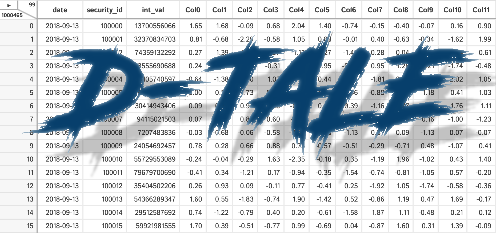

# はじめに
#### 探査的データ分析(EDA: Exploratory Data Analysis)

  - データの品質チェック　ー　 `describe()` 、 `info()` 、 `dtypes()` などのpandasライブラリ関数を使用して行うことができる。これは、いくつかの特徴、そのデータ型、重複する値、欠落値などを見つけるために使用します。
  - 統計的検定　ー　Pearson相関、Spearman相関、Kendall検定など、いくつかの統計検定は特徴量間の相関を知るために実施しますl。Pythonのstatsや statsmodel などのライブラリが使われます。
  - 定量的テスト　ー　数値特徴量の広がりや、カテゴリ特徴量のカウントを求めるために、定量的検定を行います。Pythonのpandasライブラリが使われます。
  - 可視化　ー　特徴の可視化は、データを理解するために非常に重要になります。棒グラフや円グラフなどは、カテゴリ特徴を理解するために使用され、散布図やヒストグラムは数値的特徴の理解のために使用されます。

Pythonにはこうしたデータ分析を行うためのライブラリが数多くあります。データサイエンティストは様々なデータセットを扱い、複雑な操作を実行することができます。
Python自体の学習コストは低いものの、こうしたライブラリの学習は難しく、初心者にとっては使い方を覚えるのに時間がかかることがあります。経験豊かなPythonユーザーであっても、いくつかの作業は繰り返し行われることがあり、時間を浪費してしまうことになりがちです。こんなときに役立つのが [D-Tale ](https://github.com/man-group/dtale)です。
D-Taleは探索的データ分析やデータクリーニングといったタスクの最適化を支援します。時間を節約することで、コードの洗練や機械学習モデルのチューニングなど、より重要なタスクに集中することができます。
この資料は探査的データ分析のためのPythonライブラリ D-Tale について説明したものです。

# D-Tale について
[PyPI - DTable ](https://pypi.org/project/dtale/ ) では、次のように説明されています。

> D-Taleは、FlaskのバックエンドとReactのフロントエンドを組み合わせて、Pandasのデータ構造を簡単に表示や解析する方法を提供します。Jupyterlab や python/IPython のターミナルとシームレスに統合されています。現在、このツールは DataFrame,、Series、 MultiIndex、DatetimeIndex、RangeIndex などのPandasオブジェクトをサポートしています。

# インストール
D-Taleのインストールは 次のように行います。

 bash
```
 # Linux もしくは MacOS
 $ python -m pip install dtale

 # Windows
 $ py -3 -m pip install dtale

```


# 学習用データセット

D-Tale には学習用のデータセットが内包されていません。
今回は米国のインデックスSP500の価格をダウンロードしておきます。


```
    ...: from datetime import datetime
    ...: import pandas as pd
    ...: import pandas_datareader as pdr
    ...:
    ...: start=datetime(1970, 1, 1)
    ...: end=datetime(2022, 5, 1)
    ...: stock_data = pdr.DataReader("^GSPC", 'yahoo', start, end)
    ...: stock_data.to_csv('SP500.csv')
    ...:

 In [3]:

```

あるいは、次のようなモジュールを用意しておくのもよいでしょう。

 datasets.py
```
 import pandas as pd
 from urllib.error import HTTPError

 class DatasetError(BaseException):
     pass

 class DataSet(object):
     baseurl = 'https://raw.githubusercontent.com/adamerose/datasets/master/'
     dataset_names = [
         'anscombe.csv',
         'attention.csv',
         'brain_networks.csv',
         'country_indicators.csv',
         'diamonds.csv',
         'dots.csv',
         'exercise.csv',
         'flights.csv',
         'fmri.csv',
         'gammas.csv',
         'gapminder.csv',
         'geyser.csv',
         'googleplaystore.csv',
         'googleplaystore_reviews.csv',
         'happiness.csv',
         'harry_potter_characters.csv',
         'iris.csv',
         'mi_manufacturing.csv',
         'mpg.csv',
         'netflix_titles.csv',
         'penguins.csv',
         'planets.csv',
         'pokemon.csv',
         'reddit_showerthoughts_may2015.csv',
         'seinfeld_episodes.csv',
         'seinfeld_scripts.csv',
         'stockdata.csv',
         'tips.csv',
         'titanic.csv',
         'trump_tweets.csv',
         'us_shooting_incidents.csv',
     ]

     def load_dataset(self, name, save=False):
         try:
             assert name in self.dataset_names
             exists_flag = Path(name).exists()
             if exists_flag:
                 url = 'file://' + str(Path(name).absolute())
             else:
                 url = self.baseurl + name
             df = pd.read_csv( url )
             _ = save and not exists_flag and df.to_csv(name)
             return df
         except AssertionError:
             raise DatasetError('dataset not available') from None
         except HTTPError as emsg:
             raise DatasetError(emsg)
             jjj
     def get_dataset_names(self):
         return self.dataset_names

 dataset = DataSet()
 load_dataset = dataset.load_dataset
 get_dataset_names = dataset.get_dataset_names

 if __name__ == '__main__':
     import sys
     if len(sys.argv)<=1:
         from pprint import pprint
         pprint(get_dataset_names())
     else:
         _= load_dataset(sys.argv[1], save=True)

```

 bash
```
 $ python datasets.py titanic.csv
```


# 使用方法
D-Taleの呼び出しは非常に簡単です。


```
 In [2]: # %load c01_demo.py
    ...: import pandas as pd
    ...: import dtale
    ...:
    ...: filename = 'titanic.csv'
    ...: # filename = 'SP500.csv'
    ...:
    ...: df = pd.read_csv(filename)
    ...: dtale.show(df).open_browser()
    ...:

 In [3]:
```

このコードを実行すると、ブラウザを起動してD-Tale のWebインタフェースにアクセスすることができます。
 `.open_browser()` メソッドを呼び出さない場合は、WebインタフェースへのURLが表示されます。
プラットフォームにより異なりますが、基本的には次のURLをブラウザで開くとD-TaleのGUI にアクセスすることができます。

 bash
```
 # macOS
 $ open http://localhost:40000/dtale/main/1

```


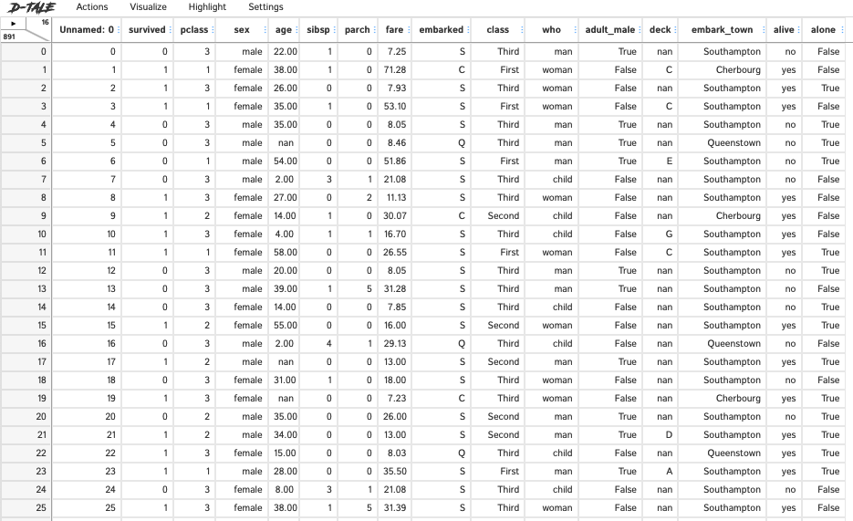

D-Tale にアクセスするとデータを表示さます。Pandas との大きな違いは、左上にあるメニューで、ここからデータに対して様々なことを行うことができます。また、D-TaleはPandasよりも多くの情報を最初の画面に表示しています。ブラウザのサイズを広げるか、スクロールしたり、ズームアウトすることで、より多くのデータを見ることができます。Pandasでは次のようなコードを実行して表示されるカラムや行を設定する必要があります。


```
 pd.set_option('display.max_rows', 60)
 pd.set_option('display.max_columns', 60)
```

メニューの側にデータセットの列と行の数が表示されていることに注目してください。これも、Pandas では次のコードを実行して出力を読み判断する必要があります。


```
 In [3]: df.info()
 <class 'pandas.core.frame.DataFrame'>
 RangeIndex: 891 entries, 0 to 890
 Data columns (total 16 columns):
  #   Column       Non-Null Count  Dtype
 ---  ------       --------------  -----
  0   Unnamed: 0   891 non-null    int64
  1   survived     891 non-null    int64
  2   pclass       891 non-null    int64
  3   sex          891 non-null    object
  4   age          714 non-null    float64
  5   sibsp        891 non-null    int64
  6   parch        891 non-null    int64
  7   fare         891 non-null    float64
  8   embarked     889 non-null    object
  9   class        891 non-null    object
  10  who          891 non-null    object
  11  adult_male   891 non-null    bool
  12  deck         203 non-null    object
  13  embark_town  889 non-null    object
  14  alive        891 non-null    object
  15  alone        891 non-null    bool
 dtypes: bool(2), float64(2), int64(5), object(7)
 memory usage: 99.3+ KB

 In [4]:

```

また、マウスを上部に移動させると、ナビゲーションメニューが表示されます。

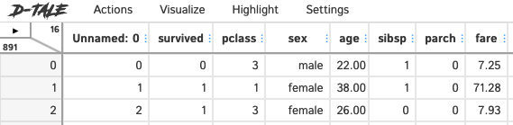

D-Tale は、Jupyter Notebook/Jupyterlab から利用することができます。しかし、なくても問題ありません。Python/IPython のREPLで利用することもでき、これも特徴のひとつになっています。


# データの要約
D-Tale では、データセットの値の数、欠損値、頻度、平均値、中央値、パーセンタイル、標準偏差、歪度、語数などの統計の要約などの情報を見ることができます。データの種類によっては、ヒストグラム、時系列、棒グラフなど、データのプロットも表示されます。

列の名前をクリックし、[# Describe (Column Analysis) ]をクリックするだけで、たくさんの有益な情報を見ることができます。

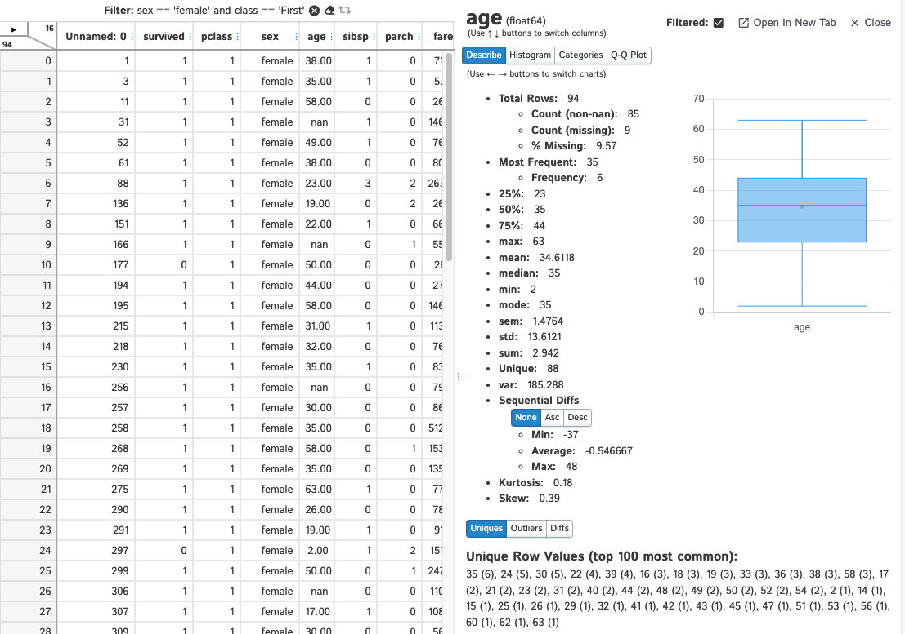


あるいは、ナビゲーションメニューの [# Visualize] から　[# Describe] を選択してから列を選択しても同じことができます。

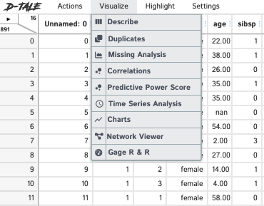
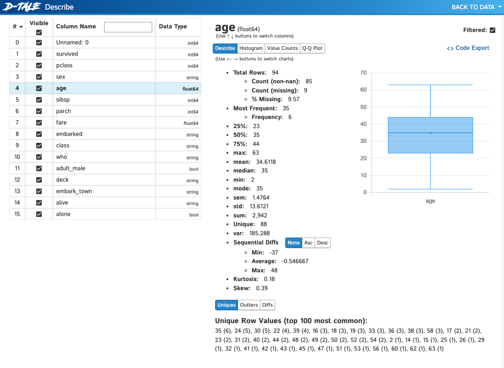


# データ操作
## データタイプの変更
D-Tale はワンクリックでdatatypeを変更することができます。もちろん、Pandasではdatatypeの変更は初心者でも難しくありませんし、1つか2つの特徴量（フィーチャー）の変更に問題はないでしょう。しかし、300以上の特徴量のデータ型を変更する必要がある場合はどうでしょうか？これは実務環境では珍しいことではなく、このような作業のために何百行ものコードを入力するのは非常に効率が悪くなります。D-Taleを使えば、数回のクリックでデータ型を変更することができます。

タイタニックのデータセットでは日付の変数はありませんが、例えば、SP500の日足のデータセットでは、日付のカラムが文字列になっています。これをDateTimeに変更する場合は、カラム名をクリックし、カラムメニューから [# type Conversion] をクリックし、インプレースで変更するか、新しいカラムを作成するかを選択するだけです。データ型を選択し、日付の書式を変更し、適用をクリックします。これで完了です。

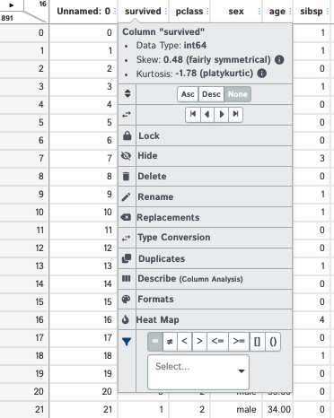

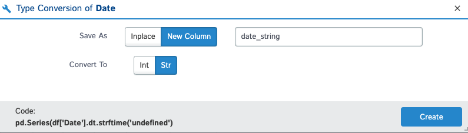

このときに、内部で実行されるコードが表示されていることに注目してください。カラムのタイプが Datetime であれば、カラムをクリックすると歪度（わいど、Skewness: 分布の対称性を表す） と 尖度（せんど、Kurtosis：分布のとんがり具合を表す) にの情報が表示されます。

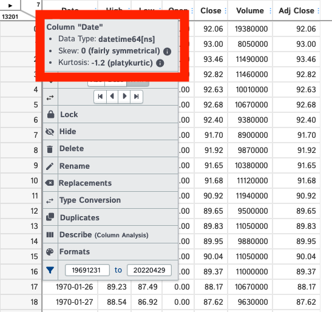


それらの値の横にあるアイコンをクリックすると歪度(わいど)と尖度(せんど)についての説明を見ることができます。


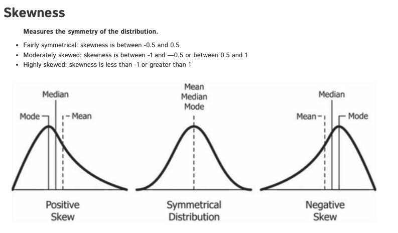
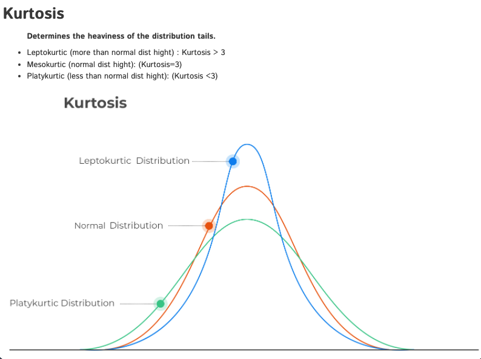


## 異なる書式で新しいカラムを作成する
異なる書式を持つ新しいカラムを作成することもできます。例示のために、Datetime に変換した列を日付カラムを文字列に変換してみましょう。変換したいカラム名をクリックし、[# Type Conversion] をクリックし、[# New Column] をクリックし、新しいカラム名を選択し、データ型をStr と選択するだけです。


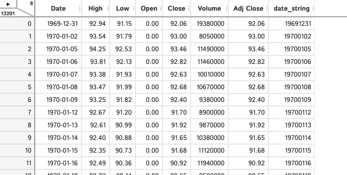

## 列の削除
列を削除するためのコードを入力する場合は、次のような簡単なコードです。


```
 df['date_string']].drop()
```

D-Tale ではもっと簡単です。削除したいカラムをクリックして[# Delete] をクリックし、ポップアップウィンドウで[# Yes] をクリックすれば、カラムは削除されます。

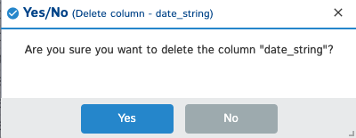


## 列の名前を変更
列の名前を変更する手順は、クリック、名前の変更、更新。これだけです。列の名前をクリックし、[# Rename] をクリックし、名前を指定して [# Update] をクリックして更新するだけです。

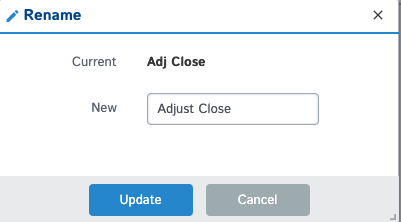

# データフレーム操作
D-Tale ではデータフレームを操作するためにコードを書く必要はありません。
ナビゲーションメニューから[# DataFrame Functions]　を選択するとメニューから指示することができます。
例えば、タイタニックのデータセットでは、列 `sex` では、文字列で  `female` か　 `male` となっています。これをブール値に変換する場合はマウス操作だけで処理できます。
まず、文字列  `female` を1 に変換して、新しい列  `sex_bool` に格納します。


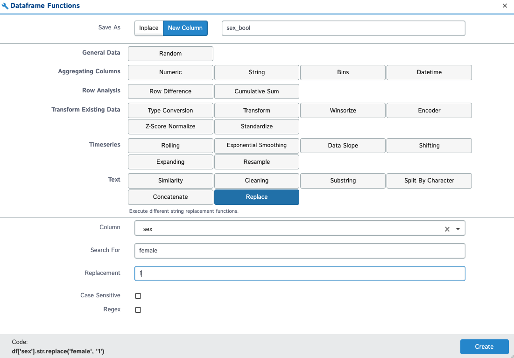
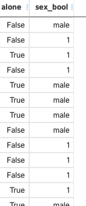

このままでは、まだ文字列  `male` がまだ残っているので、再度[# DataFrame Functions] を選択します。
こんどは、上記の操作で追加された列  `sex_bool` を [# Inplace] で処理します。

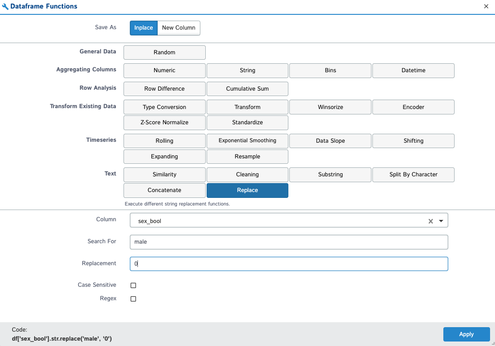

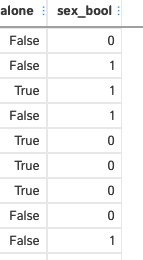


# データ変換
## データクリーン
データが文字列などのときに複数のスペースをひとつにしたり、数字と文字列が混在しているときに数値を削除したり、特定の単語gを削除したりといったようにデータを調整したいときも、マウス操作だけで処理することができます。
列のタイトルをクリックして[# Clean Column] を選択します。表示される項目から目的の処理を選ぶだけです。

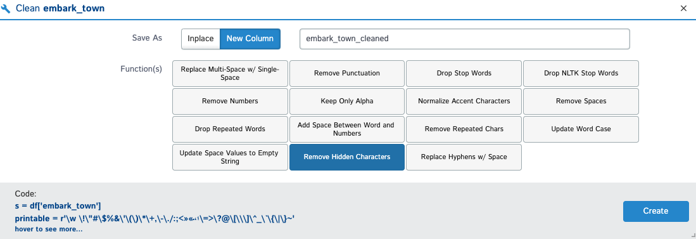

このとき、下部にその処理を行うための Python コードが表示されます。


## データのフィルタリング
データのフィルタリングは非常に簡単です。フィルタリングしたい列をクリックします。下部に、フィルタリングのオプションが表示されます。どのようなデータ型でもフィルタリングすることができます。D-Taleには、等しい、より大きい/より小さい、異なる、などのフィルタリングオプションがあります。

例示のためにタイタニックのデータセットに戻って性別(Sex)が女性（female) のデータを抽出してみましょう。

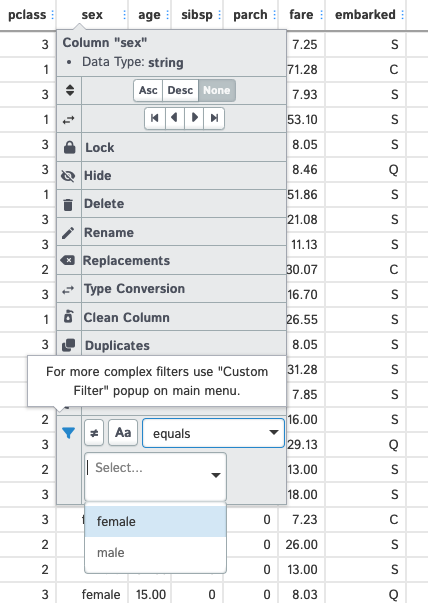

続けて、客室クラス(Class)がファースト（First)でフィルターしてみます。

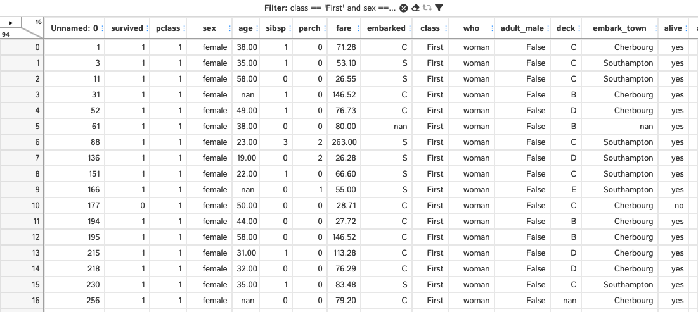

あるいは、ナビゲーションメニューの[# Actions] から [# Custom Filter] をクリックして条件を設定することもできます。

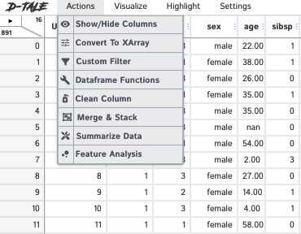


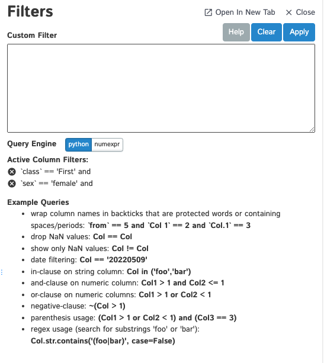

日付データの場合の例を見てみましょう。先の SP500の価格推移は1970年からなので、直近15年を見てみたいときは次のようにします。ナビゲーションメニューの[# Actions] から [# Custom Filter] をクリックします。
条件は　 `Date >= 2007-01-01` と指定するだけです。

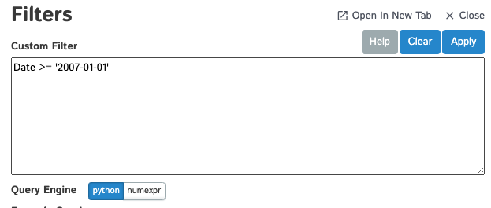


# データのエクスポート
フィルターしたデータをエクスポートしてみましょう。ナビゲーションメニューの[# D-Tale] から [# Export] をクリックします。

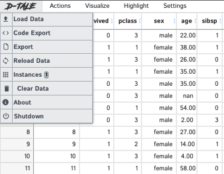

フォーマットを選択すると、フィルターされたデータセットがプラットフォームで設定されているダウンロード領域に保存されます。

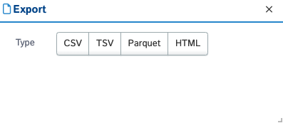

ファイル名は、  `data_export_xxxxxxxxxxxxx.csv` のようになります。（ `xxxxxxxxxxxxx` には数値が入ります）

# Group By
グループ分け(Group By) は、左上の▶アイコンをクリックして[# Summarize Data] を選択するか、ナビゲーションメニューから[# Summarize Data] を選択します。グループ分けしたい列、関数（sum、count、mean、medianなど）を選択すれば完了です。同じタブで開いても、別のタブで開いても構いません。例えば、タイタニックのデータセットで男女別の生存者数を集計する場合は、次のようになります。

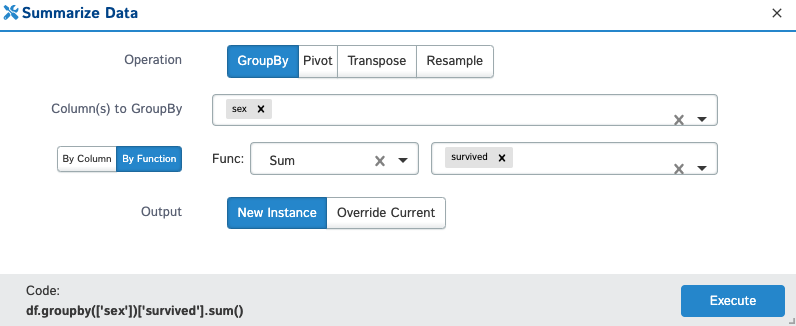

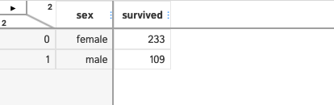


# データのマージ
2つのデータフレームをマージするには、左上の▶アイコンをクリックすると、新しいタブが開きます。UIから直接データセットをアップロードすることができます。データセットを選択し、どのように結合するかを選択すれば、ほぼ完了です。また、他のプロジェクトで使用する場合は、下部にあるコードを見ることができます。


# データの可視化
データの可視化は、データ解析の中で最も面倒で時間のかかる作業です。初心者が見栄えの良いチャートを表示する場合では、プロットライブラリの使い方を調べている時間の方が長くなり、苦痛を伴う作業となります。D-Tale　ではほぼ自動でその手助けをしてくれます。数回のクリックで可視化チャートを作成することができ、そのPythonコードを取得して何を処理しているのかを学ぶことができるようになっています。

## 棒グラフ(Bar Chart)
棒グラフを作成する方法はいくつかあります。例えば列  `age` についてデータ要約(Summarize Data) をしたときは、上部に[# Histgram]　のボタンをクリックするだけで年齢の分布をプロットしたチャートを見ることができます。


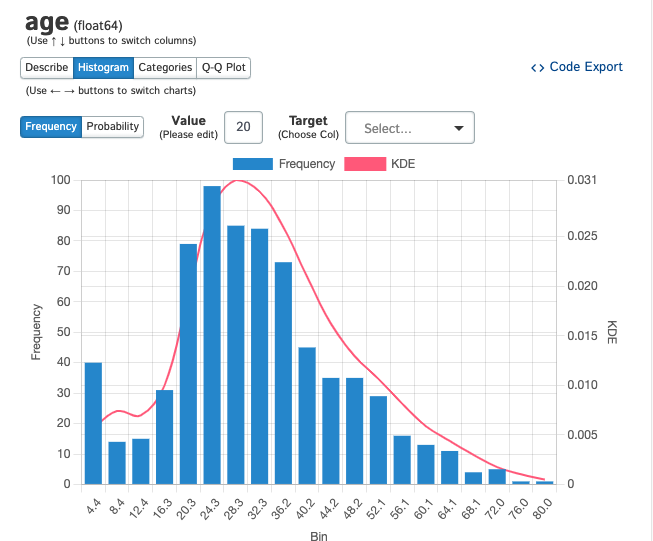

ここでターゲットを  `survived` にすると、年齢別の生死を可視化してくれます。

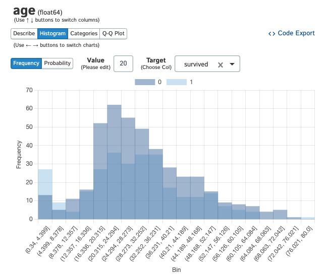


または、、左上の▶アイコンをクリックして、[# Chart] を選択して ChartGUIを開きます。ここでは、13種類から1つのプロットタイプを選択することができます。そこから、XとYの変数、もしあれば集計の種類を選択することで可視化することができます。

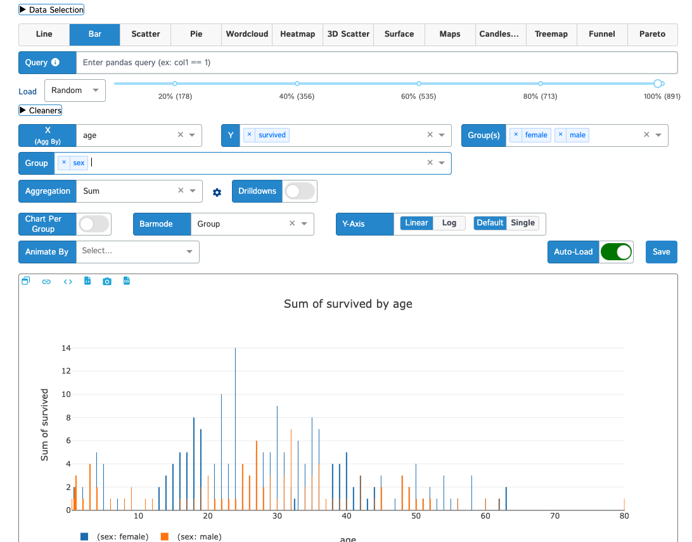

この設定は、年齢( `age` )別の生存者を性別で比較した例です。20代前半では女性の方が多く生存していることが見て取れます。
チャートの上部に表示されているアイコンの[# < >] をクリックすると、このチャートを表示するための Pythonコードがポップアップウィンドウに表示されます。


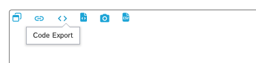
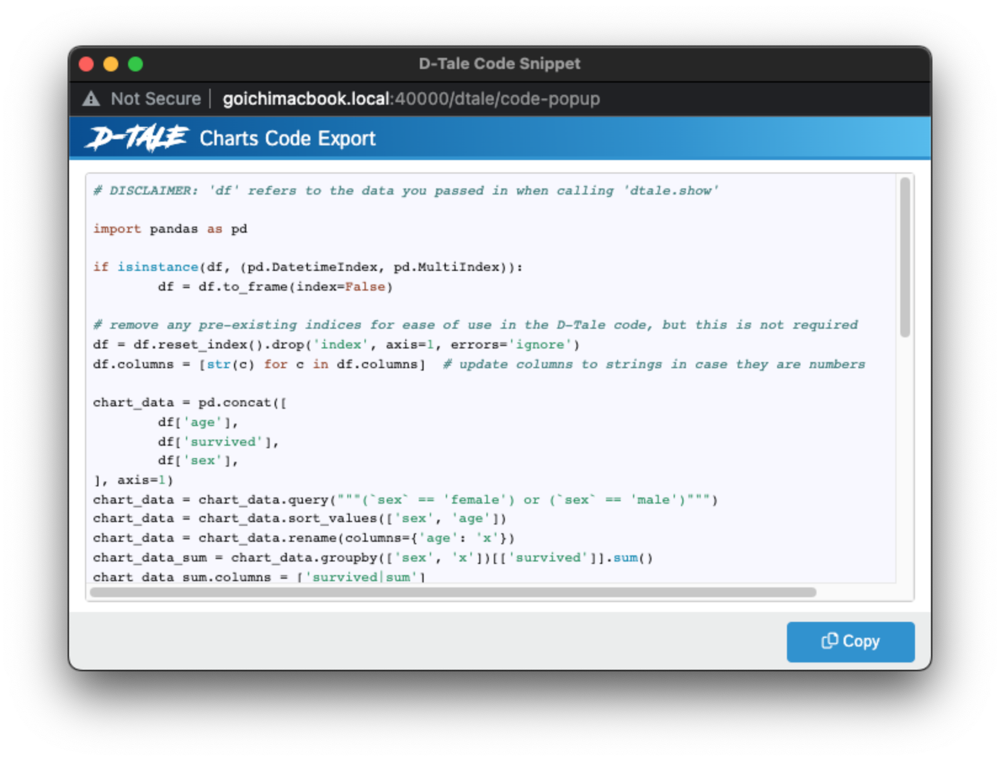

## ライングラフ
SP500の価格推移をライングラフで表示してみましょう。ナビゲーションメニュー [# Visualize] から [# Chart] を選択します。
カスタムフィルダーで処理してデータを使うこともできますが、このチャートメニューからでも[# Query] に条件式を指定することでフィルタリングすることができます。

  - Query:  `Date >= '2008-01-01'`
  - X: Date
  - Y: Adj Close

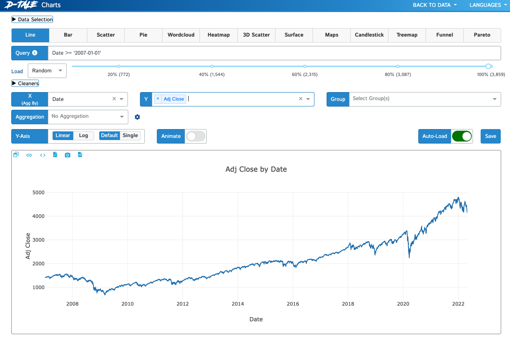

2008年のリーマンショック、2020年のコロナショックなどが見て取れます。

# データの相関関係分析
相関分析の例示のためのデータセットとしては少し微妙ですが、SP500インデックスの価格推移のデータセットでの相関をみてみましょう。ナビゲーションメニュー [# Visualize] から [# Correlations] を選択します。

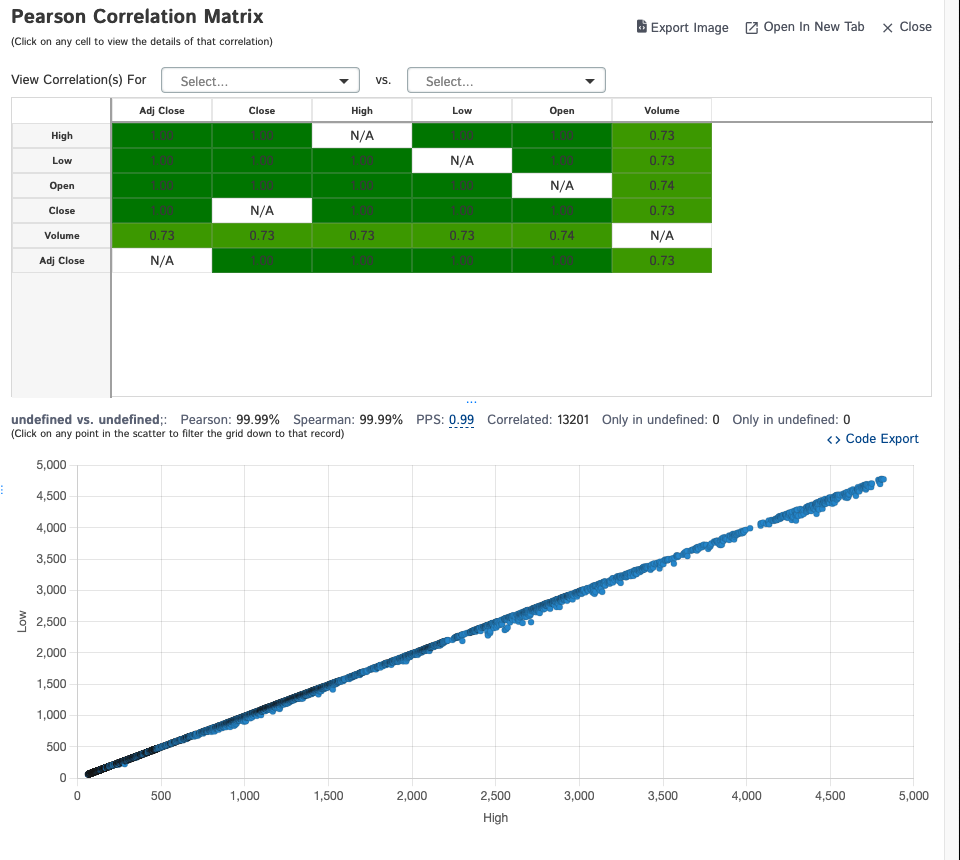

Volume と価格(Adj Close)には強い相関があることがわかります。

# 時系列分析
SP500インデックスの価格推移のデータセットでの相関をみてみましょう。
ナビゲーションメニュー [# Visualize] から [# Time Series Analysis] を選択します。Pythonの統計分析でよく使用されるstatsmodels を利用して可視化してれます。実際のところstatsmodels を利用するためには統計学の知識が必要になるため初心者には難しいツールなのですが、D-Tale を使うことで簡単に利用することができます。もっとも、結果を評価するためには統計学の知識が必要になることには留意してください。

  - Index: Date
  - Column: Ajd Close

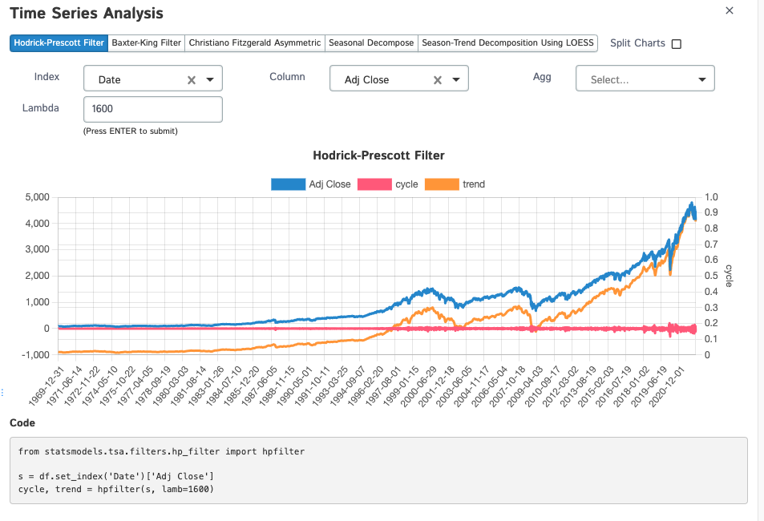
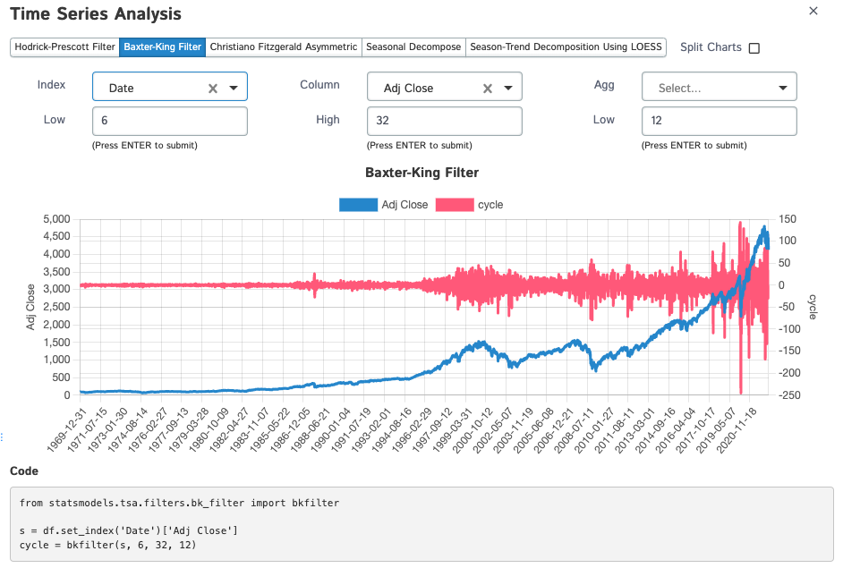
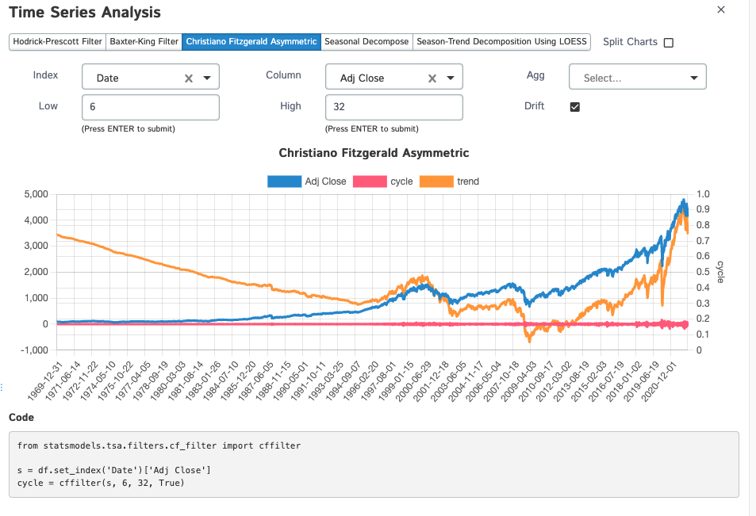


# データのハイライト
ナビゲーションメニューから [# Highlight] をクリックすると各項目に応じたハイライト表示をしてくれます。

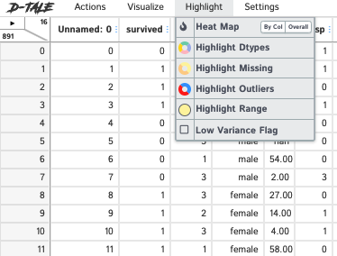

欠損地をハイライトさせるためには、[# Highlight Missing] を選択します。
左上の▶アイコンをクリックし[# Highlight Missing] を選択しても同じ結果が得られます。

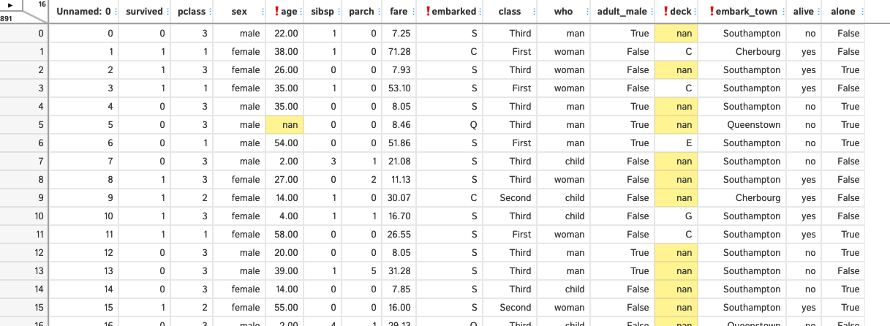


# まとめ
D-Tale を使用するとデータフレームを直感的な操作でデータ変換やフィルタリング、可視化が行えるようになります。すぐに結果が欲しい実務での利用にも適しています。またコードエクスポートによるPythonコードはデータ分析の初心者にとっては非常に利用価値が高いツールと言えるでしょう。


# 参考
- D-Table
  - [PyPI - Dtable ](https://pypi.org/project/dtale/)
  - [ソースコード ](https://github.com/man-group/dtale)
- statsmodels
  - [PyPI - statsmodels ](https://pypi.org/project/statsmodels/)
  - [ソースコード ](https://github.com/statsmodels/statsmodels)
  - [公式ドキュメント ](https://www.statsmodels.org/stable/index.html)


